# GEVSY - Panduan Admin
## Guide Book untuk Administrator Aplikasi Meet BPS

---

## Daftar Isi

### [BAB 1 - Pendahuluan](#bab-1--pendahuluan)
- [1.1 Tentang Aplikasi](#11-tentang-aplikasi)
- [1.2 Fitur Utama](#12-fitur-utama)
- [1.3 Akun Admin](#13-akun-admin)

### [BAB 2 - Autentikasi (Login & Logout)](#bab-2--autentikasi)
- [2.1 Login](#21-login)
- [2.2 Logout](#22-logout)

### [BAB 3 - Dashboard Admin](#bab-3--dashboard-admin)
- [3.1 Melihat Dashboard](#31-melihat-dashboard)
- [3.2 Statistik yang Ditampilkan](#32-statistik-yang-ditampilkan)

### [BAB 4 - Manajemen User](#bab-4--manajemen-user)
- [4.1 Melihat Daftar User](#41-melihat-daftar-user)
- [4.2 Membuat User Baru](#42-membuat-user-baru)
- [4.3 Edit User](#43-edit-user)
- [4.4 Hapus User](#44-hapus-user)

### [BAB 5 - Manajemen Role & Permission](#bab-5--manajemen-role)
- [5.1 Melihat Daftar Role](#51-melihat-daftar-role)
- [5.2 Membuat Role Baru](#52-membuat-role-baru)
- [5.3 Edit Role & Permission](#53-edit-role--permission)
- [5.4 Hapus Role](#54-hapus-role)

### [BAB 6 - Manajemen Meeting](#bab-6--manajemen-meeting)
- [6.1 Melihat Daftar Meeting](#61-melihat-daftar-meeting)
- [6.2 Membuat Meeting Baru](#62-membuat-meeting-baru)
- [6.3 Detail Meeting](#63-detail-meeting)
- [6.4 Edit Meeting](#64-edit-meeting)
- [6.5 Hapus Meeting](#65-hapus-meeting)

### [BAB 7 - Manajemen Agenda](#bab-7--manajemen-agenda)
- [7.1 Melihat Daftar Agenda](#71-melihat-daftar-agenda)
- [7.2 Edit Agenda](#72-edit-agenda)
- [7.3 Hapus Agenda](#73-hapus-agenda)

### [BAB 8 - Manajemen Notulensi](#bab-8--manajemen-notulensi)
- [8.1 Melihat Daftar Notulensi](#81-melihat-daftar-notulensi)
- [8.2 Detail Notulensi](#82-detail-notulensi)
- [8.3 Edit Notulensi](#83-edit-notulensi)
- [8.4 Share/Akses Notulensi](#84-shareakses-notulensi)
- [8.5 Download PDF](#85-download-pdf)

### [BAB 9 - Rekaman Audio & Video](#bab-9--rekaman)
- [9.1 Rekaman Audio](#91-rekaman-audio)
- [9.2 Rekaman Video](#92-rekaman-video)

### [BAB 10 - Manajemen Transkrip](#bab-10--manajemen-transkrip)
- [10.1 Melihat Daftar Transkrip](#101-melihat-daftar-transkrip)
- [10.2 Detail Transkrip](#102-detail-transkrip)
- [10.3 Edit Transkrip](#103-edit-transkrip)

### [BAB 11 - Riwayat Meeting](#bab-11--riwayat-meeting)
- [11.1 Melihat Riwayat](#111-melihat-riwayat)
- [11.2 Hapus Riwayat](#112-hapus-riwayat)

### [BAB 12 - Profil Admin](#bab-12--profil-admin)
- [12.1 Edit Profil](#121-edit-profil)
- [12.2 Ganti Password](#122-ganti-password)

### [LAMPIRAN](#lampiran)
- [A. Daftar Permission Lengkap](#a-daftar-permission-lengkap)
- [B. Glosarium](#b-glosarium)
- [C. Informasi Teknis](#c-informasi-teknis)

---

# BAB 1 - Pendahuluan

## 1.1 Tentang Aplikasi

**Meet BPS (GEVSY)** adalah aplikasi video meeting berbasis web yang terintegrasi dengan kecerdasan buatan (AI) untuk menghasilkan notulensi (meeting minutes) secara otomatis. Aplikasi ini dibangun dengan teknologi Laravel 12, LiveKit WebRTC, dan didukung oleh AI DeepSeek/Gemini untuk summarization serta Whisper untuk transkripsi audio.

Sebagai **Admin**, Anda memiliki akses penuh untuk mengelola semua aspek aplikasi.

## 1.2 Fitur Utama

| Fitur | Deskripsi |
|-------|-----------|
| Video Meeting | Pertemuan virtual dengan kamera, mic, dan screen sharing |
| Live Transcription | Transkripsi real-time menggunakan Whisper AI |
| AI Notulensi | Generate ringkasan rapat otomatis menggunakan DeepSeek/Gemini |
| Manajemen User | Kelola akun pengguna |
| Manajemen Role | Kelola role dan permission |
| Manajemen Meeting | Kelola semua rapat |
| Role-Based Access | Akses terkontrol berdasarkan role |

## 1.3 Akun Admin

| Field | Value |
|-------|-------|
| Email | `admin@dev.com` |
| Password | `admin` |
| Role | super_admin |
| Akses | Full access ke semua fitur |

---

# BAB 2 - Autentikasi

## 2.1 Login

### Langkah 1: Buka Halaman Login

Buka browser (Chrome/Firefox/Edge) dan akses:

```
https://meet-bps.my.id/login
```


### Langkah 2: Masukkan Email Admin

Pada kolom **Email**, masukkan email admin:

```
admin@dev.com
```

### Langkah 3: Masukkan Password

Pada kolom **Password**, masukkan password admin:

```
admin
```

### Langkah 4: Klik Tombol Login

Klik tombol **"Login"** untuk masuk ke panel admin.

**Setelah Login Berhasil:**

Anda akan dialihkan ke halaman **Dashboard Admin** (`/admin`).

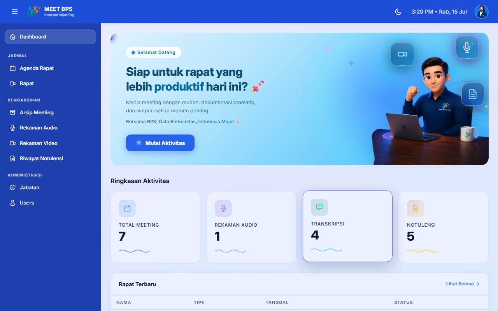

## 2.2 Logout

### Langkah 1: Klik Ikon Profil

Di pojok kanan atas halaman admin, klik ikon **profil**.

### Langkah 2: Pilih Menu Logout

Dari dropdown menu, klik tombol **"Logout"**.

### Langkah 3: Konfirmasi

Anda akan dialihkan kembali ke halaman login.

---

# BAB 3 - Dashboard Admin

## 3.1 Melihat Dashboard

### Langkah 1: Akses Dashboard

Setelah login sebagai admin, Anda akan otomatis diarahkan ke Dashboard.

Atau akses langsung:

```
https://meet-bps.my.id/admin
```


## 3.2 Statistik yang Ditampilkan

Dashboard menampilkan ringkasan statistik sistem:

| Statistik | Keterangan |
|-----------|------------|
| **Total Users** | Jumlah user terdaftar |
| **Total Meetings** | Jumlah rapat (online + offline) |
| **Online Meetings** | Jumlah rapat online |
| **Offline Meetings** | Jumlah rapat offline |
| **Total Recordings** | Jumlah rekaman audio |
| **Total Transcriptions** | Jumlah transkrip |
| **Total Notulensi** | Jumlah notulensi yang dihasilkan |
| **Recent Meetings** | 5 rapat terakhir |

---

# BAB 4 - Manajemen User

## 4.1 Melihat Daftar User

### Langkah 1: Akses Halaman Users

Klik menu **"Users"** di sidebar admin, atau akses langsung:

```
https://meet-bps.my.id/admin/users
```

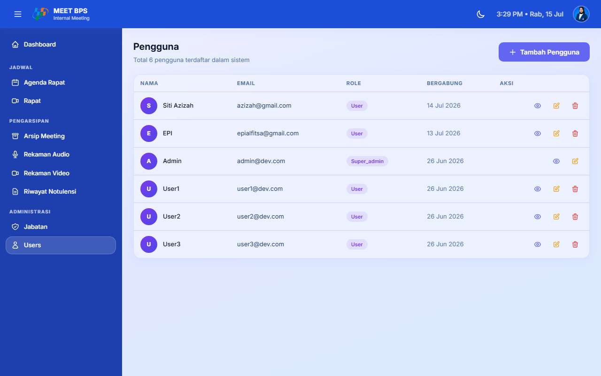

### Langkah 2: Lihat Daftar User

Halaman menampilkan daftar semua user dalam format tabel:

| Kolom | Keterangan |
|-------|------------|
| **No** | Nomor urut |
| **Nama** | Nama lengkap user |
| **Email** | Alamat email |
| **Role** | Role user (super_admin/admin/user) |
| **Aksi** | Tombol Edit, Hapus |

## 4.2 Membuat User Baru

### Langkah 1: Klik Tombol Tambah User

Di halaman Daftar Users, klik tombol **"Tambah User"** atau **"Create"**.

### Langkah 2: Isi Form User

Isi form pembuatan user:

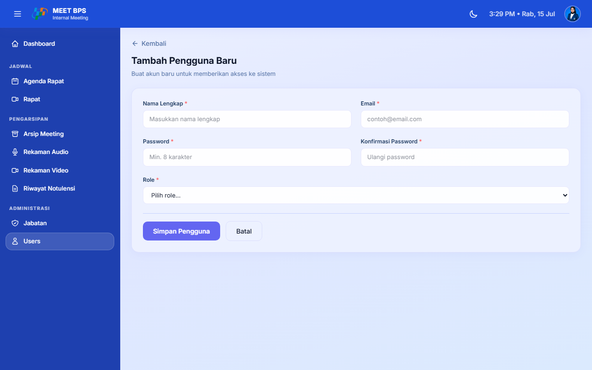

| Field | Keterangan | Wajib |
|-------|------------|-------|
| **Nama** | Nama lengkap user | Ya |
| **Email** | Alamat email (unik) | Ya |
| **Password** | Password (min 8 karakter) | Ya |
| **Konfirmasi Password** | Ulangi password | Ya |
| **Role** | Peran user (super_admin/admin/user) | Ya |

### Langkah 3: Pilih Role

Pilih role yang sesuai untuk user baru:

- **super_admin**: Akses penuh ke semua fitur
- **admin**: Akses ke panel admin
- **user**: Akses terbatas untuk penggunaan biasa

> **Catatan:** Hanya super_admin yang bisa menetapkan role `super_admin` ke user lain.

### Langkah 4: Klik Simpan

Klik tombol **"Simpan"** atau **"Create"** untuk membuat user baru.

## 4.3 Edit User

### Langkah 1: Klik Tombol Edit

Di halaman Daftar Users, klik tombol **"Edit"** pada user yang dipilih.

### Langkah 2: Ubah Data

Ubah data yang diperlukan:

- Nama
- Email
- Role
- Password (opsional)

### Langkah 3: Klik Update

Klik tombol **"Update"** untuk menyimpan perubahan.

## 4.4 Hapus User

### Langkah 1: Klik Tombol Hapus

Di halaman Daftar Users, klik tombol **"Hapus"** pada user yang dipilih.

### Langkah 2: Konfirmasi

Konfirmasi penghapusan user.

### Langkah 3: User Terhapus

User akan dihapus beserta data terkait.

> **Peringatan:**
> - User dengan role `super_admin` tidak bisa dihapus
> - Tindakan ini tidak dapat dibatalkan

---

# BAB 5 - Manajemen Role & Permission

## 5.1 Melihat Daftar Role

### Langkah 1: Akses Halaman Roles

Klik menu **"Roles"** di sidebar admin, atau akses langsung:

```
https://meet-bps.my.id/admin/roles
```

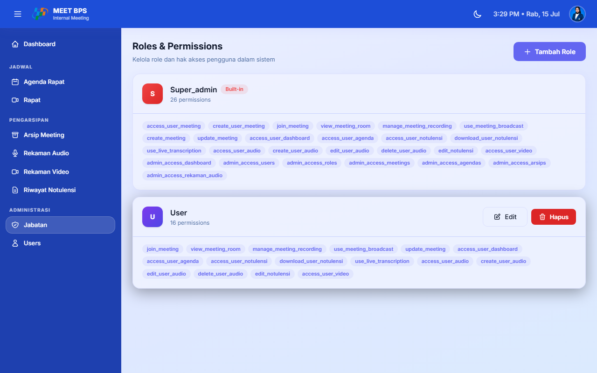

### Langkah 2: Lihat Daftar Role

Halaman menampilkan daftar semua role:

| Kolom | Keterangan |
|-------|------------|
| **Nama Role** | Nama role |
| **Guard** | Guard name (web) |
| **Permission** | Jumlah permission yang dimiliki |
| **Aksi** | Tombol Edit, Hapus |

## 5.2 Membuat Role Baru

### Langkah 1: Klik Tombol Tambah Role

Di halaman Daftar Roles, klik tombol **"Tambah Role"** atau **"Create"**.


### Langkah 2: Isi Nama Role

Masukkan nama role baru (contoh: "moderator", "viewer").

### Langkah 3: Centang Permission

Centang permission yang ingin diberikan kepada role ini.

Lihat **Lampiran A** untuk daftar lengkap permission.

### Langkah 4: Klik Simpan

Klik tombol **"Simpan"** untuk membuat role baru.

## 5.3 Edit Role & Permission

### Langkah 1: Klik Tombol Edit

Di halaman Daftar Roles, klik tombol **"Edit"** pada role yang dipilih.

### Langkah 2: Ubah Nama atau Permission

- Ubah nama role jika diperlukan
- Centang/uncentang permission sesuai kebutuhan

### Langkah 3: Klik Update

Klik tombol **"Update"** untuk menyimpan perubahan.

> **Catatan:** Role `super_admin` tidak bisa diedit.

## 5.4 Hapus Role

### Langkah 1: Klik Tombol Hapus

Di halaman Daftar Roles, klik tombol **"Hapus"** pada role yang dipilih.

### Langkah 2: Konfirmasi

Konfirmasi penghapusan role.

> **Catatan:** Role `super_admin` tidak bisa dihapus.

---

# BAB 6 - Manajemen Meeting

## 6.1 Melihat Daftar Meeting

### Langkah 1: Akses Halaman Meetings

Klik menu **"Meetings"** di sidebar admin, atau akses langsung:

```
https://meet-bps.my.id/admin/meetings
```

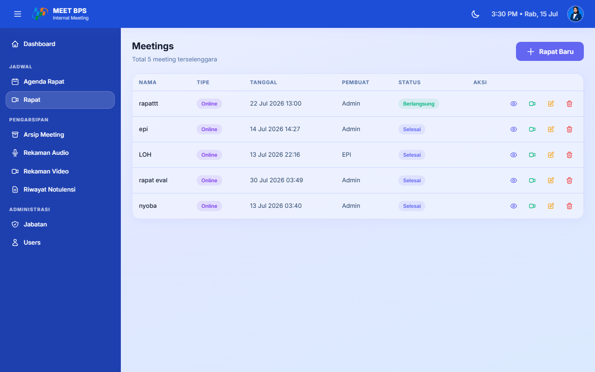

### Langkah 2: Lihat Daftar Meeting

Halaman menampilkan daftar semua meeting:

| Kolom | Keterangan |
|-------|------------|
| **Nama Meeting** | Judul rapat |
| **Tanggal** | Tanggal pelaksanaan |
| **Status** | Status meeting (Menunggu/Berlangsung/Selesai) |
| **Pembuat** | Nama pembuat meeting |
| **Aksi** | Tombol Lihat, Edit, Hapus |

## 6.2 Membuat Meeting Baru

### Langkah 1: Klik Tombol Create Meeting

Di halaman Daftar Meetings, klik tombol **"Create Meeting"** atau **"Tambah"**.

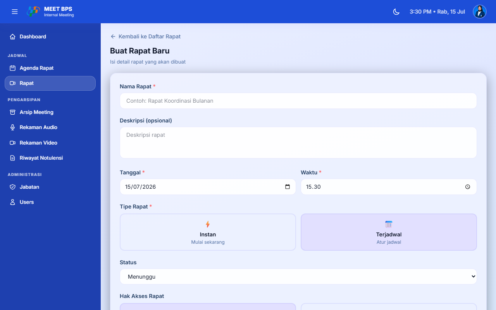

### Langkah 2: Isi Form Meeting

Isi form pembuatan meeting:

| Field | Keterangan | Wajib |
|-------|------------|-------|
| **Nama Rapat** | Judul meeting | Ya |
| **Tanggal & Waktu** | Jadwal pelaksanaan | Untuk meeting terjadwal |
| **Tipe Meeting** | Online atau Offline | Ya |
| **Hak Akses** | "Semua Orang" atau "Pilih User" | Ya |
| **User Picker** | Pilih user (jika hak akses "Pilih User") | Opsional |
| **Deskripsi** | Keterangan tambahan | Opsional |

### Langkah 3: Klik Simpan

Klik tombol **"Simpan"** untuk membuat meeting baru.

## 6.3 Detail Meeting

### Langkah 1: Klik Tombol Lihat

Di halaman Daftar Meetings, klik tombol **"Lihat"** atau **"Detail"** pada meeting yang dipilih.


### Langkah 2: Lihat Informasi Meeting

Halaman detail meeting menampilkan:

- **Informasi Meeting**: Nama, tanggal, status, tipe
- **Daftar Peserta**: User yang sudah join
- **Daftar Akses User**: User yang diundang (jika undangan)
- **Rekaman Audio**: Audio terkait meeting
- **Agenda**: Agenda terkait
- **Transkrip**: Transkrip meeting
- **Notulensi**: Hasil notulensi AI

## 6.4 Edit Meeting

### Langkah 1: Klik Tombol Edit

Di halaman Detail Meeting, klik tombol **"Edit"**.

### Langkah 2: Ubah Data Meeting

Ubah data meeting yang diperlukan.

### Langkah 3: Klik Update

Klik tombol **"Update"** untuk menyimpan perubahan.

## 6.5 Hapus Meeting

### Langkah 1: Klik Tombol Hapus

Di halaman Detail Meeting atau Daftar Meetings, klik tombol **"Hapus"**.

### Langkah 2: Konfirmasi

Konfirmasi penghapusan meeting.

> **Peringatan:** Meeting beserta data terkait (rekaman, transkrip, notulensi) akan dihapus.

---

# BAB 7 - Manajemen Agenda

## 7.1 Melihat Daftar Agenda

### Langkah 1: Akses Halaman Agendas

Klik menu **"Agendas"** di sidebar admin, atau akses langsung:

```
https://meet-bps.my.id/admin/agendas
```

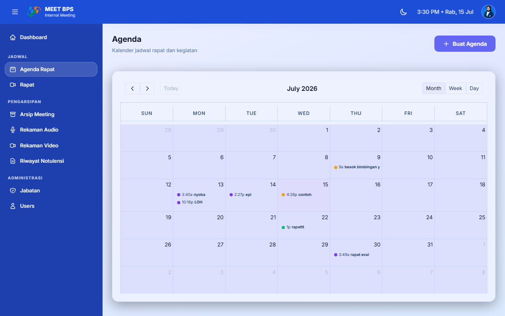

### Langkah 2: Lihat Daftar Agenda

Halaman menampilkan semua rapat sebagai agenda dalam format tabel:

| Kolom | Keterangan |
|-------|------------|
| **Tanggal** | Tanggal rapat |
| **Waktu** | Waktu rapat |
| **Nama Rapat** | Judul rapat |
| **Tipe** | Tipe agenda |
| **Keterangan** | Deskripsi rapat |
| **Aksi** | Tombol Edit, Hapus |

## 7.2 Edit Agenda

### Langkah 1: Klik Tombol Edit

Di halaman Daftar Agendas, klik tombol **"Edit"** pada agenda yang dipilih.

### Langkah 2: Ubah Data Agenda

Ubah data agenda yang diperlukan.

### Langkah 3: Klik Update

Klik tombol **"Update"** untuk menyimpan perubahan.

## 7.3 Hapus Agenda

### Langkah 1: Klik Tombol Hapus

Di halaman Daftar Agendas, klik tombol **"Hapus"** pada agenda yang dipilih.

### Langkah 2: Konfirmasi

Konfirmasi penghapusan agenda.

---

# BAB 8 - Manajemen Notulensi

## 8.1 Melihat Daftar Notulensi

### Langkah 1: Akses Halaman Notulensi

Klik menu **"Notulensi"** di sidebar admin, atau akses langsung:

```
https://meet-bps.my.id/admin/notulensis
```

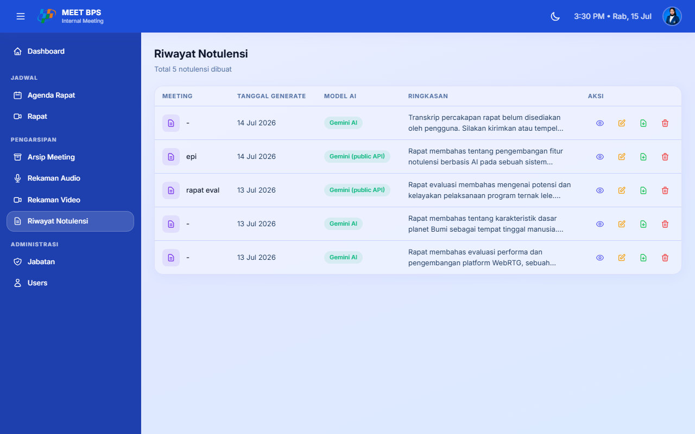

### Langkah 2: Lihat Daftar Notulensi

Halaman menampilkan daftar semua notulensi:

| Kolom | Keterangan |
|-------|------------|
| **Nama Rapat** | Judul meeting terkait |
| **Tanggal** | Tanggal generate notulensi |
| **Model AI** | Model AI yang digunakan |
| **Aksi** | Tombol Lihat, Edit, Download PDF, Hapus |

## 8.2 Detail Notulensi

### Langkah 1: Klik Tombol Lihat

Di halaman Daftar Notulensi, klik tombol **"Lihat"** pada notulensi yang dipilih.


### Langkah 2: Lihat Informasi Notulensi

Halaman detail menampilkan:

- **Ringkasan**: Deskripsi singkat rapat
- **Topik Dibahas**: Daftar topik yang dibahas
- **Keputusan Penting**: Keputusan yang diambil
- **Action Items**: Tugas yang harus diselesaikan (Tugas, PIC, Deadline)
- **Risiko / Catatan**: Risiko dan catatan penting
- **Info Akses**: Mode akses notulensi (Peserta/Semua User/Pilih User)
- **Tombol Share**: Untuk mengubah akses notulensi

## 8.3 Edit Notulensi

### Langkah 1: Klik Tombol Edit

Di halaman Detail Notulensi, klik tombol **"Edit"**.


### Langkah 2: Edit Hasil Notulensi

Anda dapat mengedit:

- **Nama Rapat**
- **Ringkasan**
- **Topik Dibahas** (tambah/hapus baris)
- **Keputusan Penting** (tambah/hapus baris)
- **Action Items** (tambah/hapus baris, edit Tugas/PIC/Deadline)
- **Risiko / Catatan** (tambah/hapus baris)

### Langkah 3: Klik Simpan Perubahan

Klik tombol **"Simpan Perubahan"** setelah selesai mengedit.

## 8.4 Share/Akses Notulensi

### Langkah 1: Klik Tombol Share atau Ubah Akses

Di halaman Detail atau Edit Notulensi, klik tombol **"Share"** atau **"Ubah Akses"**.

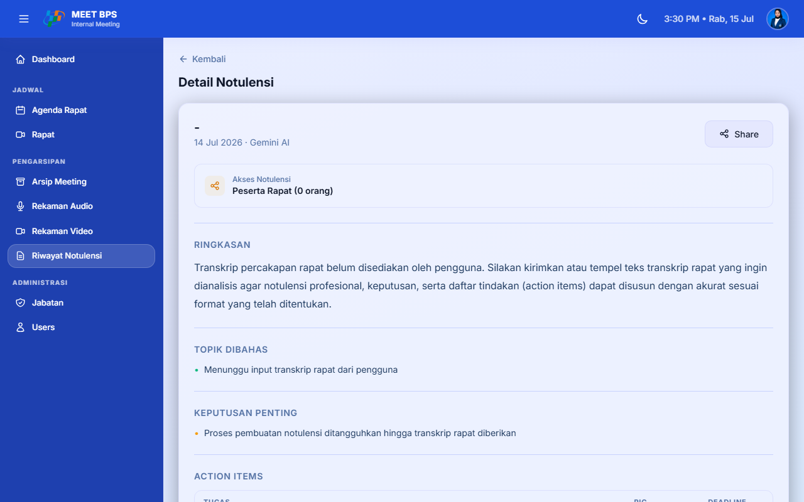

### Langkah 2: Pilih Mode Akses

Pilih salah satu mode akses:

| Mode | Keterangan |
|------|------------|
| **Peserta Rapat** | Hanya peserta rapat yang bisa melihat |
| **Semua User** | Semua user di sistem bisa melihat |
| **Pilih User** | Hanya user tertentu saja yang bisa melihat |

### Langkah 3: Pilih User (Jika Memilih "Pilih User")

Jika memilih mode **"Pilih User"**:

1. Kotak pencarian user akan muncul
2. Ketik nama user yang ingin diundang
3. Klik nama user dari hasil pencarian
4. User yang dipilih akan muncul sebagai chip/tag

### Langkah 4: Klik Simpan

Klik tombol **"Simpan"** untuk menyimpan perubahan akses.

## 8.5 Download PDF

### Langkah 1: Klik Tombol Download PDF

Di halaman Detail Notulensi, klik tombol **"Unduh PDF"** atau **"Download PDF"**.

### Langkah 2: File Terunduh

File PDF notulensi akan otomatis terunduh ke komputer Anda.

---

# BAB 9 - Rekaman Audio & Video

## 9.1 Rekaman Audio

### Langkah 1: Akses Halaman Rekaman Audio

Klik menu **"Rekaman Audio"** di sidebar admin, atau akses langsung:

```
https://meet-bps.my.id/admin/rekaman-audio
```

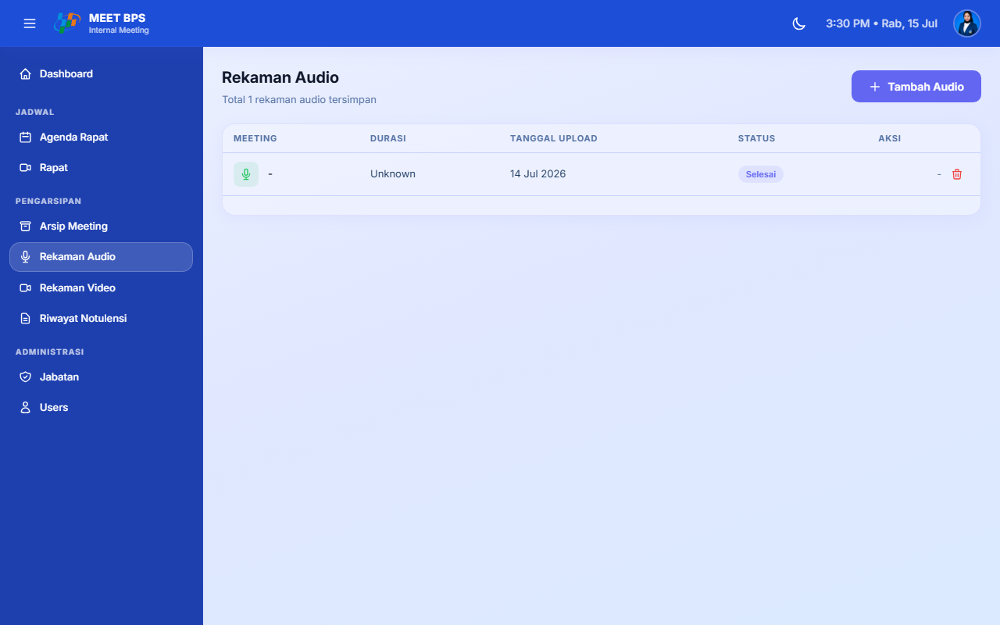

### Langkah 2: Lihat Daftar Rekaman

Halaman menampilkan semua rekaman audio dari rapat:

| Kolom | Keterangan |
|-------|------------|
| **Nama Rapat** | Judul meeting terkait |
| **File** | Nama file audio |
| **Durasi** | Durasi rekaman |
| **Ukuran** | Ukuran file |
| **Aksi** | Tombol Play, Hapus |

### Langkah 3: Memutar Audio

Klik tombol **"Play"** atau **"Putar"** pada rekaman untuk memutar audio di browser.

### Langkah 4: Hapus Audio

Klik tombol **"Hapus"** pada rekaman untuk menghapus.

> **Peringatan:** File audio juga akan dihapus dari server.

## 9.2 Rekaman Video

### Langkah 1: Akses Halaman Rekaman Video

Akses halaman rekaman video melalui menu admin.

### Langkah 2: Lihat Daftar Video

Halaman menampilkan semua rekaman video (screen recording) dari rapat.

| Kolom | Keterangan |
|-------|------------|
| **Nama Rapat** | Judul meeting terkait |
| **File** | Nama file video |
| **Durasi** | Durasi rekaman |
| **Ukuran** | Ukuran file |
| **Aksi** | Tombol Stream, Download, Hapus |

### Langkah 3: Fitur Video Admin

- **Streaming**: Putar video langsung di browser
- **Download**: Unduh file video
- **Hapus**: Hapus rekaman video

---

# BAB 10 - Manajemen Transkrip

## 10.1 Melihat Daftar Transkrip

### Langkah 1: Akses Halaman Transkrips

Klik menu **"Transkrips"** di sidebar admin, atau akses langsung:

```
https://meet-bps.my.id/admin/transkrips
```

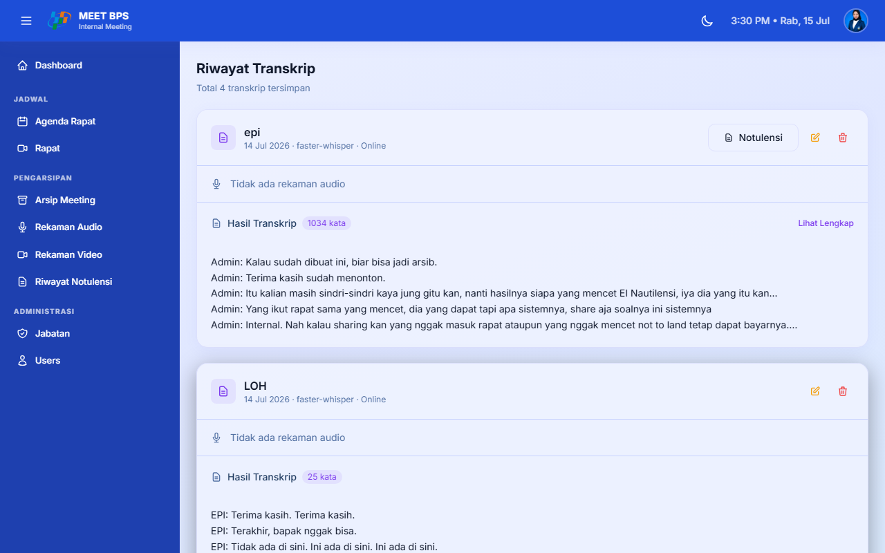

### Langkah 2: Lihat Daftar Transkrip

Halaman menampilkan daftar semua transkrip:

| Kolom | Keterangan |
|-------|------------|
| **Nama Rapat** | Judul meeting terkait |
| **Model AI** | Model AI yang digunakan |
| **Tanggal** | Tanggal transkrip dibuat |
| **Aksi** | Tombol Lihat, Edit, Hapus |

## 10.2 Detail Transkrip

### Langkah 1: Klik Tombol Lihat

Di halaman Daftar Transkrips, klik tombol **"Lihat"** pada transkrip yang dipilih.


### Langkah 2: Lihat Transkrip Lengkap

Menampilkan teks transkripsi lengkap dari rapat.

## 10.3 Edit Transkrip

### Langkah 1: Klik Tombol Edit

Di halaman Detail Transkrip, klik tombol **"Edit"**.

### Langkah 2: Ubah Teks Transkrip

Ubah teks transkrip sesuai kebutuhan.

### Langkah 3: Klik Update

Klik tombol **"Update"** untuk menyimpan perubahan.

---

# BAB 11 - Riwayat Meeting

## 11.1 Melihat Riwayat

### Langkah 1: Akses Halaman Riwayat Meeting

Klik menu **"Riwayat Meeting"** di sidebar admin, atau akses langsung:

```
https://meet-bps.my.id/admin/riwayat-meeting
```

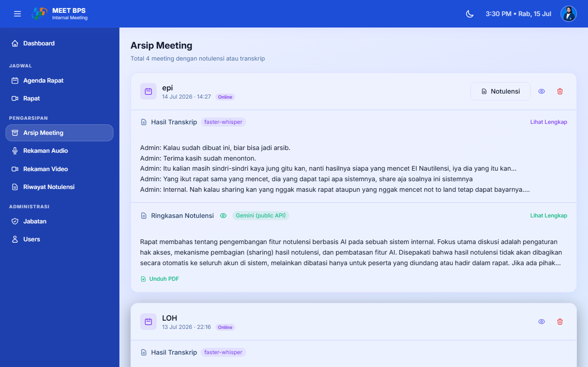

### Langkah 2: Lihat Daftar Riwayat

Menampilkan daftar rapat yang sudah selesai beserta transkrip dan notulensinya.

| Kolom | Keterangan |
|-------|------------|
| **Nama Rapat** | Judul meeting |
| **Tanggal** | Tanggal rapat |
| **Status** | Status meeting |
| **Aksi** | Tombol Lihat Detail, Hapus |

## 11.2 Hapus Riwayat

### Langkah 1: Klik Tombol Hapus

Di halaman Riwayat Meeting, klik tombol **"Hapus"** pada rapat yang dipilih.

### Langkah 2: Konfirmasi

Konfirmasi penghapusan riwayat.

### Cascade Delete

Saat menghapus riwayat rapat, data terkait juga akan dihapus:

- Transkrip rapat
- Notulensi rapat
- Arsip rapat

---

# BAB 12 - Profil Admin

## 12.1 Edit Profil

### Langkah 1: Akses Halaman Profil

Klik menu **"Profile"** di sidebar admin, atau akses langsung:

```
https://meet-bps.my.id/admin/profile
```

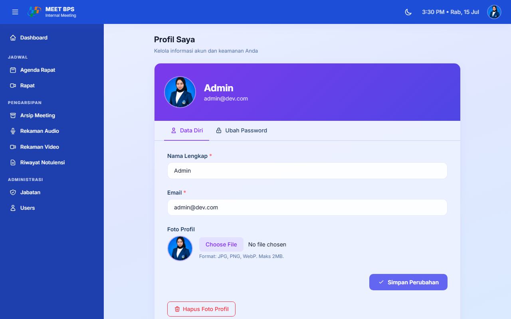

### Langkah 2: Edit Data

Ubah data profil:

- **Nama**: Nama lengkap baru
- **Email**: Alamat email baru
- **Foto Profil**: Upload atau ubah foto avatar

### Langkah 3: Klik Simpan

Klik tombol **"Simpan"** untuk menyimpan perubahan.

## 12.2 Ganti Password

### Langkah 1: Buka Halaman Profil

Buka halaman profil admin.

### Langkah 2: Scroll ke Bagian Ganti Password

Scroll ke bagian bawah halaman.

### Langkah 3: Masukkan Password Lama

Masukkan password lama untuk verifikasi.

### Langkah 4: Masukkan Password Baru

Masukkan password baru:

- Minimal 8 karakter
- Huruf besar (A-Z)
- Huruf kecil (a-z)
- Angka (0-9)

### Langkah 5: Konfirmasi Password Baru

Masukkan ulang password baru.

### Langkah 6: Klik Simpan

Klik tombol **"Simpan"** untuk menyimpan password baru.

---

# Lampiran

## A. Daftar Permission Lengkap

### Permission Admin

| No | Permission | Keterangan |
|----|-----------|------------|
| 1 | `admin_access_dashboard` | Mengakses dashboard admin |
| 2 | `admin_access_users` | Mengelola user |
| 3 | `admin_access_roles` | Mengelola role & permission |
| 4 | `admin_access_meetings` | Mengelola meeting |
| 5 | `admin_access_agendas` | Mengelola agenda |
| 6 | `admin_access_arsips` | Mengelola arsip |
| 7 | `admin_access_rekaman_audio` | Mengelola rekaman audio |

### Permission User

| No | Permission | Keterangan |
|----|-----------|------------|
| 1 | `join_meeting` | Bergabung ke meeting |
| 2 | `view_meeting_room` | Melihat ruang meeting |
| 3 | `create_meeting` | Membuat meeting baru |
| 4 | `update_meeting` | Mengubah meeting |
| 5 | `manage_meeting_recording` | Mengelola rekaman meeting |
| 6 | `use_meeting_broadcast` | Menggunakan fitur broadcast |
| 7 | `access_user_agenda` | Mengakses agenda |
| 8 | `use_live_transcription` | Menggunakan transkripsi live |
| 9 | `access_user_notulensi` | Melihat notulensi |
| 10 | `download_user_notulensi` | Download notulensi PDF |
| 11 | `access_user_audio` | Mengakses fitur audio |
| 12 | `create_user_audio` | Membuat audio baru |
| 13 | `edit_user_audio` | Mengedit audio |
| 14 | `delete_user_audio` | Menghapus audio |
| 15 | `edit_notulensi` | Mengedit notulensi |
| 16 | `access_user_video` | Mengakses video rekaman |

## B. Glosarium

| Istilah | Penjelasan |
|---------|-----------|
| **WebRTC** | Web Real-Time Communication, teknologi untuk komunikasi real-time di browser |
| **LiveKit** | Platform open-source untuk video/audio conferencing via WebRTC |
| **Whisper** | Model AI dari OpenAI untuk transkripsi (speech-to-text) |
| **DeepSeek** | Model AI untuk summarization (text summarization) |
| **Gemini** | Model AI dari Google untuk summarization (fallback DeepSeek) |
| **Notulensi** | Ringkasan atau catatan hasil rapat (meeting minutes) |
| **Transkrip** | Teks lengkap percakapan dalam rapat |
| **Arsip** | Pengarsipan dokumen rapat (notulensi, transkrip, rekaman) |
| **Agenda** | Jadwal atau rencana rapat |
| **Pipeline** | Alur kerja otomatis (extract -> transcribe -> summarize -> PDF) |
| **Role** | Peran pengguna dalam sistem (admin, user, super_admin) |
| **Permission** | Hak akses pengguna terhadap fitur tertentu |
| **VAD** | Voice Activity Detection, deteksi aktivitas suara |
| **PCM** | Pulse-Code Modulation, format audio digital |
| **DomPDF** | Library PHP untuk generate file PDF |

## C. Informasi Teknis

| Komponen | Teknologi |
|----------|-----------|
| Backend | Laravel 12, PHP 8.4 |
| Database | MySQL 8.0 |
| Frontend | Alpine.js, Tailwind CSS v4 |
| Video/Audio | LiveKit WebRTC |
| Transkripsi | Whisper (Python server) |
| AI Summarization | DeepSeek API + Gemini API |
| PDF Generation | DomPDF |
| Server | Nginx + PHP-FPM + Supervisor |
| Real-time | Laravel Echo (Pusher) + WebRTC Signaling |

---

**Dokumen ini dibuat pada: Juli 2026**
**Versi Aplikasi: 1.0**
**Untuk: Administrator Aplikasi Meet BPS**