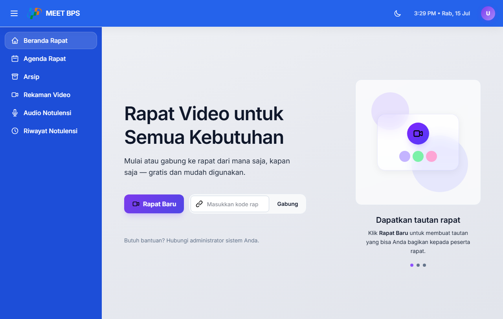
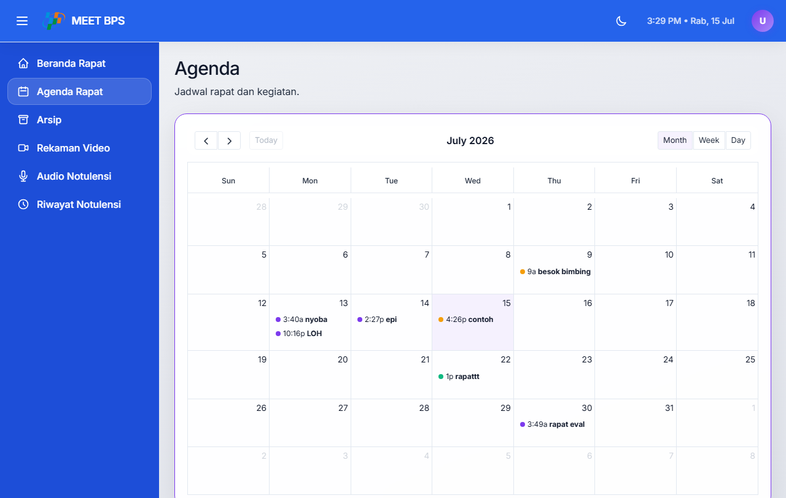
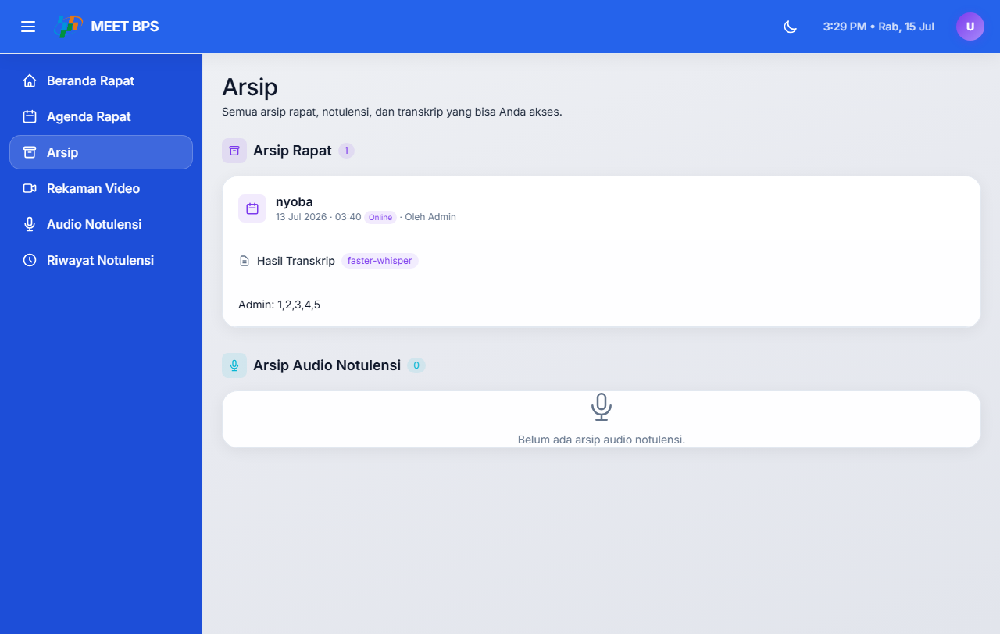
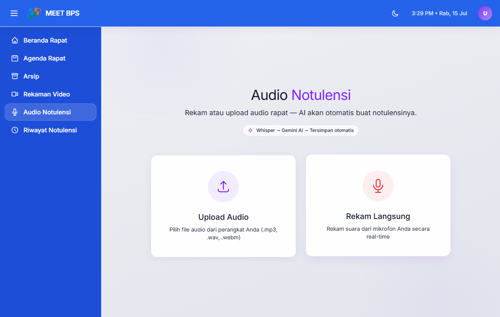
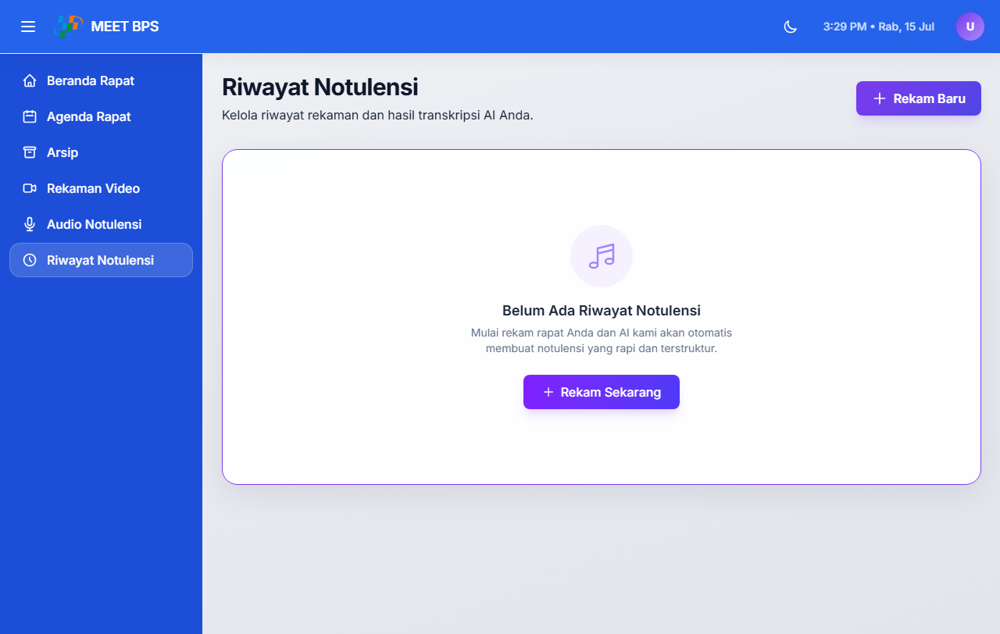
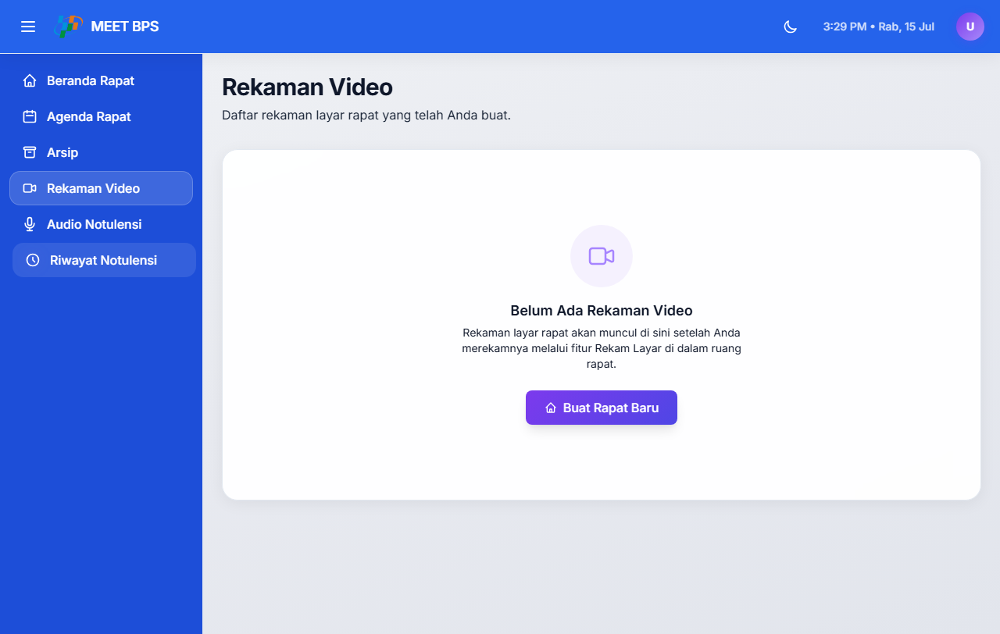
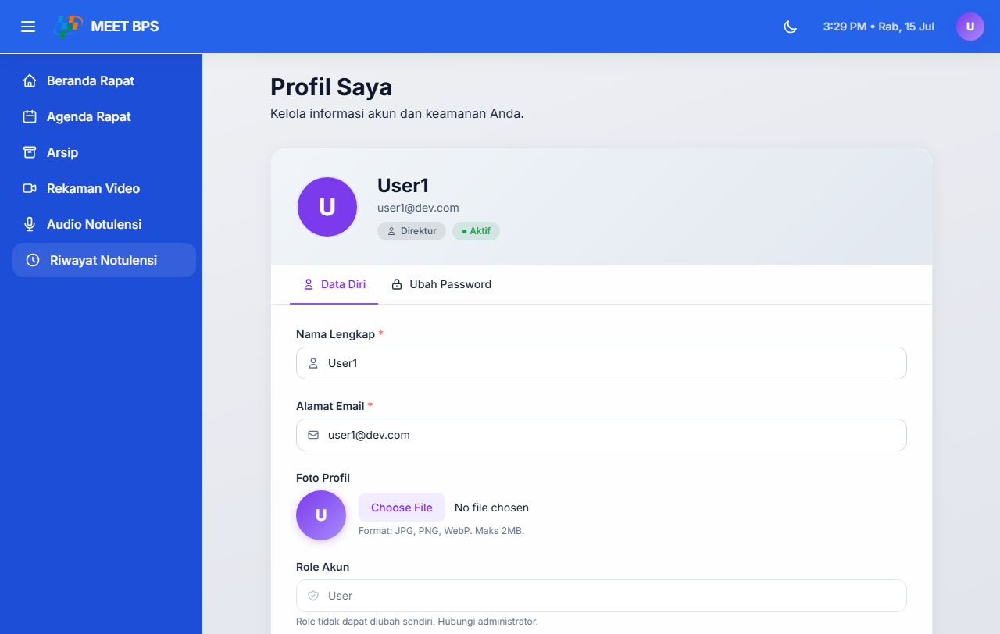

# GEVSY - Panduan Pengguna
## Guide Book untuk Pengguna Aplikasi Meet BPS

---

## Daftar Isi

### [BAB 1 - Pendahuluan](#bab-1--pendahuluan)
- [1.1 Tentang Aplikasi](#11-tentang-aplikasi)
- [1.2 Fitur Utama](#12-fitur-utama)
- [1.3 Akun User](#13-akun-user)

### [BAB 2 - Autentikasi (Login & Logout)](#bab-2--autentikasi)
- [2.1 Login](#21-login)
- [2.2 Logout](#22-logout)

### [BAB 3 - Join Meeting](#bab-3--join-meeting)
- [3.1 Halaman Join Meeting](#31-halaman-join-meeting)
- [3.2 Bergabung dengan Kode Meeting](#32-bergabung-dengan-kode-meeting)
- [3.3 Membuat Meeting Baru](#33-membuat-meeting-baru)

### [BAB 4 - Ruang Meeting](#bab-4--ruang-meeting)
- [4.1 Masuk ke Ruang Meeting](#41-masuk-ke-ruang-meeting)
- [4.2 Kontrol Dasar (Kamera, Mic, Screen Share)](#42-kontrol-dasar)
- [4.3 Transkripsi Live](#43-transkripsi-live)
- [4.4 AI Notulensi](#44-ai-notulensi)
- [4.5 Keluar dari Meeting](#45-keluar-dari-meeting)

### [BAB 5 - Agenda / Kalender](#bab-5--agenda)
- [5.1 Melihat Agenda](#51-melihat-agenda)
- [5.2 Membuat Meeting dari Agenda](#52-membuat-meeting-dari-agenda)

### [BAB 6 - Arsip](#bab-6--arsip)
- [6.1 Melihat Arsip Rapat](#61-melihat-arsip-rapat)
- [6.2 Melihat Notulensi](#62-melihat-notulensi)
- [6.3 Melihat Transkrip](#63-melihat-transkrip)
- [6.4 Share Notulensi](#64-share-notulensi)
- [6.5 Download PDF Notulensi](#65-download-pdf-notulensi)

### [BAB 7 - Audio Notulensi](#bab-7--audio-notulensi)
- [7.1 Rekam Audio Baru](#71-rekam-audio-baru)
- [7.2 Upload File Audio](#72-upload-file-audio)
- [7.3 History Audio](#73-history-audio)
- [7.4 Detail Audio Notulensi](#74-detail-audio-notulensi)
- [7.5 Edit Audio Notulensi](#75-edit-audio-notulensi)

### [BAB 8 - Video Rekaman](#bab-8--video-rekaman)
- [8.1 Melihat Daftar Video](#81-melihat-daftar-video)
- [8.2 Menonton Video](#82-menonton-video)

### [BAB 9 - Profil Pengguna](#bab-9--profil)
- [9.1 Melihat Profil](#91-melihat-profil)
- [9.2 Edit Profil](#92-edit-profil)
- [9.3 Ganti Password](#93-ganti-password)

### [LAMPIRAN](#lampiran)
- [A. Glosarium](#a-glosarium)
- [B. Informasi Teknis](#b-informasi-teknis)

---

# BAB 1 - Pendahuluan

## 1.1 Tentang Aplikasi

**Meet BPS (GEVSY)** adalah aplikasi video meeting berbasis web yang terintegrasi dengan kecerdasan buatan (AI) untuk menghasilkan notulensi (meeting minutes) secara otomatis. Aplikasi ini dibangun dengan teknologi Laravel 12, LiveKit WebRTC, dan didukung oleh AI DeepSeek/Gemini untuk summarization serta Whisper untuk transkripsi audio.

Aplikasi ini dirancang untuk mendukung kegiatan rapat virtual organisasi BPS (Badan Pusat Statistik).

## 1.2 Fitur Utama

| Fitur | Deskripsi |
|-------|-----------|
| Video Meeting | Pertemuan virtual dengan kamera, mic, dan screen sharing |
| Live Transcription | Transkripsi real-time menggunakan Whisper AI |
| AI Notulensi | Generate ringkasan rapat otomatis menggunakan DeepSeek/Gemini |
| Audio Notulensi | Rekam atau upload audio, lalu generate notulensi |
| Agenda Kalender | Kalender untuk melihat jadwal rapat |
| Arsip | Pengarsipan rapat, transkrip, dan notulensi |

## 1.3 Akun User

| Field | Value |
|-------|-------|
| Email | `user1@dev.com` / `user2@dev.com` / `user3@dev.com` |
| Password | `user` |
| Role | user |
| Akses | Fitur meeting, audio, agenda, arsip |

---

# BAB 2 - Autentikasi

## 2.1 Login

### Langkah 1: Buka Halaman Login

Buka browser (Chrome/Firefox/Edge) dan akses:

```
https://meet-bps.my.id/login
```


### Langkah 2: Masukkan Email

Pada kolom **Email**, masukkan alamat email yang terdaftar.

Contoh: `user1@dev.com`

### Langkah 3: Masukkan Password

Pada kolom **Password**, masukkan password yang sesuai.

Contoh: `user`

### Langkah 4: Centang Remember Me (Optional)

Centang opsi **"Remember me"** jika Anda ingin sesi login tetap aktif di browser Anda. Dengan ini, Anda tidak perlu login ulang saat membuka kembali aplikasi.

### Langkah 5: Klik Tombol Login

Klik tombol **"Login"** untuk masuk ke aplikasi.

**Setelah Login Berhasil:**

Anda akan dialihkan ke halaman **Join Meeting** (`/join`) sebagai halaman utama untuk user.


> **Catatan Penting:**
> - Jika email atau password salah, akan muncul pesan error "Email atau password salah"
> - Pastikan email dan password sudah benar sebelum menekan tombol Login

## 2.2 Logout

### Langkah 1: Klik Ikon Profil

Di pojok kanan atas halaman, klik ikon **profil** (berisi foto atau inisial nama Anda).

### Langkah 2: Pilih Menu Logout

Dari dropdown menu yang muncul, klik tombol **"Logout"**.

### Langkah 3: Konfirmasi Logout

Anda akan dialihkan kembali ke halaman login. Sesi Anda telah berakhir.

> **Catatan:** Setelah logout, Anda perlu login kembali untuk mengakses aplikasi.

---

# BAB 3 - Join Meeting

## 3.1 Halaman Join Meeting

### Langkah 1: Akses Halaman Join Meeting

Setelah login sebagai user, Anda akan otomatis diarahkan ke halaman **Join Meeting**.

Atau akses langsung melalui URL:

```
https://meet-bps.my.id/join
```


### Langkah 2: Kenali Bagian Halaman

Halaman Join Meeting terdiri dari:

- **Kolom Kode Meeting**: Tempat memasukkan kode/ID meeting
- **Tombol Join**: Untuk bergabung ke meeting
- **Tombol Buat Rapat Baru**: Untuk membuat meeting baru

## 3.2 Bergabung dengan Kode Meeting

### Langkah 1: Masukkan Kode Meeting

Pada kolom **"Kode Meeting"**, masukkan kode meeting yang telah Anda dapatkan dari admin atau pembuat meeting.

Kode meeting biasanya berupa kombinasi huruf dan angka.

### Langkah 2: Klik Tombol Join

Setelah memasukkan kode, klik tombol **"Join"** atau **"Masuk"**.

### Langkah 3: Tunggu Proses

Sistem akan memverifikasi kode meeting. Jika valid, Anda akan masuk ke ruang meeting.

> **Catatan:**
> - Meeting harus dalam status "Berlangsung" untuk bisa di-join
> - Jika meeting belum dimulai, Anda akan melihat pesan bahwa meeting belum aktif
> - Jika meeting sudah selesai, Anda tidak bisa join lagi

## 3.3 Membuat Meeting Baru

### Langkah 1: Klik Tombol Buat Rapat Baru

Di halaman Join Meeting, klik tombol **"Buat Rapat Baru"**.



### Langkah 2: Isi Form Meeting

Isi form pembuatan meeting dengan data berikut:

| Field | Keterangan | Wajib |
|-------|------------|-------|
| **Nama Rapat** | Judul/nama meeting | Ya |
| **Tanggal & Waktu** | Jadwal pelaksanaan | Untuk meeting terjadwal |
| **Tipe Meeting** | Online atau Offline | Ya |
| **Hak Akses** | "Semua Orang" atau "Pilih User" | Ya |
| **User Picker** | Pilih user (muncul jika hak akses "Pilih User") | Opsional |
| **Deskripsi** | Keterangan tambahan | Opsional |

### Langkah 3: Pilih Tipe Meeting

- **Online**: Meeting dilakukan melalui video conference (WebRTC)
- **Offline**: Meeting tatap muka (hanya informasi jadwal)

### Langkah 4: Pilih Mode Waktu

- **Sekarang**: Meeting dimulai langsung
- **Terjadwal**: Pilih tanggal dan waktu untuk meeting masa depan

### Langkah 5: Pilih Hak Akses

- **Semua Orang**: Siapa saja bisa join dengan kode
- **Pilih User**: Hanya user tertentu yang diundang bisa join

### Langkah 6: Klik Buat Rapat

Klik tombol **"Buat Rapat"** untuk membuat meeting.

Meeting baru akan langsung aktif (jika mode "Sekarang") atau terjadwal untuk waktu yang dipilih.

---

# BAB 4 - Ruang Meeting

## 4.1 Masuk ke Ruang Meeting

### Langkah 1: Setelah Join Meeting

Setelah berhasil join, halaman akan menampilkan **Ruang Meeting** (Room).

### Langkah 2: Izinkan Akses Kamera dan Mikrofon

Browser akan meminta izin akses **kamera** dan **mikrofon**. Ini diperlukan agar peserta bisa melihat dan mendengar satu sama lain.

**Pesan yang muncul:**

> "meet-bps.my.id wants to use your camera and microphone"

### Langkah 3: Pilih Izin

- Klik **"Allow"** atau **"Izinkan"** untuk memberikan akses
- Centang **"Remember this choice"** agar tidak diminta lagi di kemudian hari

### Langkah 4: Masuk ke Ruang Meeting

Setelah memberikan izin, Anda akan masuk ke ruang meeting dan bisa melihat peserta lain.

## 4.2 Kontrol Dasar

### Panel Kontrol di Bagian Bawah

Tombol-tombol kontrol terdapat di bagian bawah layar:

| Tombol | Fungsi | Keterangan |
|--------|--------|------------|
| **Kamera** | Nyalakan/matikan kamera | Default: aktif |
| **Mic** | Nyalakan/matikan mikrofon | Default: aktif |
| **Screen Share** | Bagikan layar | Untuk presentasi |
| **Leave** | Keluar dari meeting | Meeting tetap berjalan |
| **End** | Akhiri meeting | Hanya pembuat meeting |

### Mengaktifkan/Mematikan Kamera

1. Klik tombol **Kamera** di toolbar
2. Ikon akan berubah menunjukkan status aktif/matikan
3. Video Anda akan hilang/muncul bagi peserta lain

### Mengaktifkan/Mematikan Mikrofon

1. Klik tombol **Mic** di toolbar
2. Ikon akan berubah menunjukkan status aktif/matikan
3. Suara Anda akan hilang/muncul bagi peserta lain

## 4.3 Screen Sharing (Berbagi Layar)

### Langkah 1: Klik Tombol Screen Share

Klik tombol **Screen Share** di toolbar bagian bawah.

### Langkah 2: Pilih Layar/Aplikasi

Dialog browser akan muncul meminta Anda memilih:

- **Seluruh Layar**: Berbagi semua yang terlihat di layar Anda
- **Jendela Aplikasi**: Berbagi aplikasi tertentu saja
- **Tab Browser**: Berbagi tab browser tertentu

### Langkah 3: Klik Share

Setelah memilih, klik tombol **"Share"**.

### Langkah 4: Berbagi Aktif

Layar Anda akan terlihat oleh semua peserta meeting.

### Langkah 5: Menghentikan Berbagi

Klik tombol **"Stop Sharing"** atau tombol Screen Share lagi untuk berhenti.

## 4.3 Transkripsi Live

Jika meeting memiliki fitur transkripsi aktif:

- Sidebar transkripsi akan muncul di sisi kanan layar
- Teks transkripsi akan muncul secara real-time saat peserta berbicara
- Setiap pembicara ditandai dengan nama dan waktu
- Transkripsi disimpan otomatis ke database

## 4.4 AI Notulensi

### Langkah 1: Klik Tombol AI Notulen

Klik tombol **"AI Notulen"** di toolbar.

> **Catatan:** Tombol ini hanya tersedia untuk **pembuat meeting**.

### Langkah 2: Proses Dimulai

Sistem akan memulai proses otomatis:

1. **Extract Audio**: Mengekstrak audio dari rekaman meeting
2. **Transcribe**: Mengubah audio menjadi teks menggunakan Whisper AI
3. **Summarize**: Meringkas transkrip menggunakan DeepSeek/Gemini AI
4. **Generate PDF**: Membuat file PDF dari hasil notulensi

### Langkah 3: Status Proses

Status proses akan ditampilkan secara real-time di layar.

### Langkah 4: Hasil Notulensi

Ketika proses selesai, hasil notulensi akan muncul dengan struktur:

- **Ringkasan**: Deskripsi singkat rapat
- **Topik Dibahas**: Daftar topik yang dibahas
- **Keputusan Penting**: Keputusan yang diambil
- **Action Items**: Tugas-tugas yang harus diselesaikan
- **Risiko / Catatan**: Risiko dan catatan penting

### Langkah 5: Download PDF

Klik tombol **"Download PDF"** untuk mengunduh notulensi dalam format PDF.

## 4.5 Keluar dari Meeting

### Leave Meeting (Keluar Sementara)

Klik tombol **"Leave"** untuk keluar dari ruang meeting.

- Meeting tetap berjalan untuk peserta lain
- Anda bisa join kembali dengan kode meeting yang sama

### End Meeting (Akhiri Meeting)

Klik tombol **"End"** untuk mengakhiri meeting.

- Meeting berakhir untuk semua peserta
- Hanya **pembuat meeting** yang bisa mengakhiri meeting
- Semua rekaman dan transkrip akan tersimpan

---

# BAB 5 - Agenda / Kalender

## 5.1 Melihat Agenda

### Langkah 1: Akses Halaman Agenda

Akses halaman agenda melalui URL:

```
https://meet-bps.my.id/agenda
```



### Langkah 2: Lihat Kalender

Halaman agenda menampilkan jadwal rapat dalam format kalender.

### Fitur Tampilan Kalender

| Fitur | Keterangan |
|-------|------------|
| **Tampilan Bulan** | Lihat semua rapat dalam satu bulan |
| **Tampilan Minggu** | Detail rapat per minggu |
| **Tampilan Hari** | Detail rapat per hari |
| **Navigasi** | Tombol panah untuk pindah bulan/minggu |
| **Hari Ini** | Tombol untuk kembali ke tanggal hari ini |

### Langkah 3: Klik Event Rapat

Klik pada event/rapat di kalender untuk melihat detail rapat.

Detail yang ditampilkan:
- Nama rapat
- Tanggal dan waktu
- Status rapat
- Link join meeting (jika online)

## 5.2 Membuat Meeting dari Agenda

### Langkah 1: Klik Tombol Buat Rapat Baru

Di halaman Agenda, klik tombol **"Buat Rapat Baru"**.

### Langkah 2: Isi Form Meeting

Isi form pembuatan meeting (lihat BAB 3.3 untuk panduan lengkap).

### Langkah 3: Klik Buat Rapat

Klik **"Buat Rapat"** untuk membuat meeting.

Meeting baru akan otomatis muncul di kalender agenda.

---

# BAB 6 - Arsip

## 6.1 Melihat Arsip Rapat

### Langkah 1: Akses Halaman Arsip

Akses halaman arsip melalui URL:

```
https://meet-bps.my.id/riwayat
```



### Langkah 2: Lihat Daftar Arsip

Halaman arsip terdiri dari dua bagian utama:

**Bagian 1: Arsip Rapat**

Menampilkan daftar rapat yang sudah selesai.

| Kolom | Keterangan |
|-------|------------|
| **Nama Rapat** | Judul meeting |
| **Tanggal** | Tanggal pelaksanaan |
| **Status** | Status meeting (Berlangsung/Selesai) |
| **Aksi** | Tombol aksi tersedia |

**Bagian 2: Arsip Audio**

Menampilkan daftar audio notulensi yang pernah dibuat.

| Kolom | Keterangan |
|-------|------------|
| **Judul** | Nama audio notulensi |
| **Tanggal** | Tanggal rekam |
| **Durasi** | Durasi rekaman |
| **Aksi** | Tombol aksi tersedia |

### Tombol Aksi yang Tersedia

| Tombol | Fungsi |
|--------|--------|
| **Notulensi** | Lihat hasil notulensi rapat |
| **Transkrip** | Lihat transkripsi lengkap rapat |
| **Rekaman** | Putar rekaman audio/video rapat |
| **Share** | Ubah akses notulensi |
| **PDF** | Download notulensi dalam format PDF |
| **Edit** | Edit hasil notulensi |

## 6.2 Melihat Notulensi

### Langkah 1: Klik Tombol Notulensi

Di halaman Arsip, klik tombol **"Notulensi"** pada kartu rapat yang diinginkan.

### Langkah 2: Lihat Hasil Notulensi

Halaman notulensi akan menampilkan:

- **Ringkasan**: Deskripsi singkat isi rapat (1-2 paragraf)
- **Topik Dibahas**: Daftar topik yang dibahas dalam rapat
- **Keputusan Penting**: Keputusan-keputusan yang diambil
- **Action Items**: Tugas-tugas yang harus diselesaikan beserta PIC dan deadline
- **Risiko / Catatan**: Risiko dan catatan penting dari rapat


## 6.3 Melihat Transkrip

### Langkah 1: Klik Tombol Transkrip

Di halaman Arsip, klik tombol **"Transkrip"** pada kartu rapat yang diinginkan.

### Langkah 2: Lihat Transkrip Lengkap

Halaman transkrip akan menampilkan teks lengkap percakapan dalam rapat, termasuk:

- Nama pembicara
- Waktu bicara
- Teks percakapan

## 6.4 Share Notulensi

### Langkah 1: Klik Tombol Share

Di halaman Arsip, klik tombol **"Share"** pada kartu rapat.


### Langkah 2: Pilih Mode Akses

Pilih salah satu mode akses berikut:

| Mode | Keterangan |
|------|------------|
| **Peserta Rapat** | Hanya peserta rapat yang bisa melihat notulensi |
| **Semua User** | Semua user di sistem bisa melihat notulensi |
| **Pilih User** | Hanya user tertentu yang dipilih yang bisa melihat |


### Langkah 3: Pilih User (Jika Memilih "Pilih User")

Jika memilih mode **"Pilih User"**:

1. Kotak pencarian user akan muncul
2. Ketik nama user yang ingin diundang
3. Klik nama user dari hasil pencarian
4. User yang dipilih akan muncul sebagai chip/tag

### Langkah 4: Klik Simpan

Klik tombol **"Simpan"** untuk menyimpan perubahan akses.

> **Catatan:** Hanya pembuat meeting yang bisa mengubah akses notulensi.

## 6.5 Download PDF Notulensi

### Langkah 1: Klik Tombol PDF

Di halaman Arsip, klik tombol **"PDF"** pada kartu rapat.

### Langkah 2: File Terunduh

File PDF notulensi akan otomatis terunduh ke komputer Anda.

Format file: `Notulensi_[Nama_Rapat].pdf`

---

# BAB 7 - Audio Notulensi

## 7.1 Rekam Audio Baru

### Langkah 1: Akses Halaman Audio

Akses halaman audio notulensi melalui URL:

```
https://meet-bps.my.id/audio
```



### Langkah 2: Klik Mulai Rekam

Klik tombol **"Mulai Rekam"** untuk memulai rekaman audio.

### Langkah 3: Berbicara ke Mikrofon

Berbicara secara jelas ke mikrofon komputer Anda.

### Langkah 4: Lihat Waveform

Gelombang audio (waveform) akan bergerak mengikuti suara Anda. Ini menunjukkan bahwa rekaman sedang berlangsung.

### Langkah 5: Klik Stop Rekam

Klik tombol **"Stop Rekam"** saat Anda selesai merekam.

### Langkah 6: Proses Otomatis

Setelah rekaman selesai, sistem akan otomatis:

1. Menyimpan file audio
2. Menjalankan transkripsi menggunakan Whisper AI
3. Menjalankan summarization menggunakan DeepSeek/Gemini
4. Menampilkan hasil notulensi

> **Catatan:** Proses ini membutuhkan waktu beberapa menit tergantung durasi audio.

## 7.2 Upload File Audio

### Langkah 1: Klik Tab Upload

Di halaman Audio Notulensi, klik tab **"Upload"**.

### Langkah 2: Pilih File Audio

Pilih file audio dari komputer Anda.

**Format yang didukung:**

- MP3
- WAV
- M4A

**Batas ukuran file:** Maksimal 20MB

### Langkah 3: Klik Upload

Klik tombol **"Upload"** untuk mengunggah file.

### Langkah 4: Proses Otomatis

Proses transkripsi dan summarization akan berjalan otomatis setelah upload selesai.

## 7.3 History Audio

### Langkah 1: Akses Halaman History

Akses halaman history audio melalui URL:

```
https://meet-bps.my.id/audio/history
```



### Langkah 2: Lihat Daftar Audio

Menampilkan daftar semua audio notulensi yang pernah Anda buat.

| Kolom | Keterangan |
|-------|------------|
| **Judul** | Nama audio notulensi |
| **Tanggal** | Tanggal rekam |
| **Durasi** | Durasi rekaman |
| **Status** | Status pemrosesan |
| **Aksi** | Tombol aksi tersedia |

### Tombol Aksi

| Tombol | Fungsi |
|--------|--------|
| **Lihat** | Lihat detail audio notulensi |
| **Edit** | Edit hasil notulensi |
| **Download PDF** | Unduh notulensi dalam format PDF |
| **Hapus** | Hapus audio notulensi |

## 7.4 Detail Audio Notulensi

### Langkah 1: Klik Tombol Lihat

Di halaman History Audio, klik tombol **"Lihat"** atau **"Detail"** pada audio yang diinginkan.


### Langkah 2: Lihat Informasi Audio

Halaman detail menampilkan:

- **Informasi Audio**: Tanggal rekam, durasi
- **Hasil Transkripsi**: Teks lengkap percakapan
- **Ringkasan Notulensi**: Ringkasan hasil AI
- **Topik Dibahas**: Daftar topik
- **Keputusan Penting**: Keputusan yang diambil
- **Action Items**: Tugas-tugas yang harus diselesaikan

### Langkah 3: Aksi Tersedia

Tombol aksi yang tersedia:

| Tombol | Fungsi |
|--------|--------|
| **Edit** | Edit hasil notulensi |
| **Download PDF** | Unduh notulensi dalam format PDF |
| **Hapus** | Hapus audio notulensi |

## 7.5 Edit Audio Notulensi

### Langkah 1: Klik Tombol Edit

Di halaman Detail Audio, klik tombol **"Edit"**.


### Langkah 2: Edit Hasil Notulensi

Anda dapat mengedit:

- **Judul** rapat
- **Ringkasan** notulensi
- **Topik Dibahas** (tambah/hapus baris)
- **Keputusan Penting** (tambah/hapus baris)
- **Action Items** (tambah/hapus baris, edit Tugas/PIC/Deadline)
- **Risiko / Catatan** (tambah/hapus baris)

### Langkah 3: Klik Simpan Perubahan

Setelah selesai mengedit, klik tombol **"Simpan Perubahan"**.

> **Catatan:** Perubahan akan langsung tersimpan dan terlihat oleh pengguna lain yang memiliki akses.

---

# BAB 8 - Video Rekaman

## 8.1 Melihat Daftar Video

### Langkah 1: Akses Halaman Video

Akses halaman video melalui URL:

```
https://meet-bps.my.id/videos
```



### Langkah 2: Lihat Daftar Video

Menampilkan daftar rekaman layar (screen recording) dari rapat yang Anda ikuti.

| Kolom | Keterangan |
|-------|------------|
| **Nama Rapat** | Judul meeting terkait |
| **Tanggal** | Tanggal rekaman |
| **Durasi** | Durasi rekaman |
| **Aksi** | Tombol aksi tersedia |

### Otorisasi Akses

Hanya **creator meeting**, **peserta meeting**, atau **admin** yang bisa mengakses video.

## 8.2 Menonton Video

### Langkah 1: Klik Tombol Putar

Di halaman Video, klik tombol **"Putar"** atau **"Tonton"** pada video yang dipilih.

### Langkah 2: Putar Video

Video akan diputar di halaman baru atau modal.

### Langkah 3: Kontrol Player

Gunakan kontrol player untuk:

- **Play/Pause**: Memutar atau menjeda video
- **Volume**: Mengatur volume
- **Fullscreen**: Memperbesar layar
- **Seek**: Melompat ke bagian tertentu

---

# BAB 9 - Profil Pengguna

## 9.1 Melihat Profil

### Langkah 1: Akses Halaman Profil

Akses halaman profil melalui URL:

```
https://meet-bps.my.id/profile
```



### Langkah 2: Lihat Informasi Profil

Halaman profil menampilkan:

- **Nama Lengkap**: Nama Anda di sistem
- **Email**: Alamat email terdaftar
- **Foto Profil**: Foto avatar Anda
- **Role**: Peran Anda di sistem (user/admin/super_admin)
- **Tanggal Daftar**: Kapan Anda terdaftar di sistem

## 9.2 Edit Profil

### Langkah 1: Klik Tombol Edit

Di halaman Profil, klik tombol **"Edit"** atau **"Ubah Profil"**.

### Langkah 2: Ubah Data

Ubah data yang ingin diubah:

- **Nama**: Nama lengkap baru
- **Email**: Alamat email baru

### Langkah 3: Upload Foto Profil (Optional)

1. Klik area foto profil atau tombol **"Upload Foto"**
2. Pilih file gambar dari komputer
3. Format yang didukung: JPG, PNG, WebP
4. Ukuran maksimal: 2MB
5. Foto akan otomatis terupload

### Langkah 4: Klik Simpan

Klik tombol **"Simpan"** untuk menyimpan perubahan.

## 9.3 Ganti Password

### Langkah 1: Buka Halaman Profil

Buka halaman profil Anda.

### Langkah 2: Scroll ke Bagian Ganti Password

Scroll ke bagian bawah halaman hingga menemukan form **"Ganti Password"**.

### Langkah 3: Masukkan Password Lama

Masukkan password lama Anda untuk verifikasi.

### Langkah 4: Masukkan Password Baru

Masukkan password baru dengan ketentuan:

- Minimal 8 karakter
- Harus mengandung huruf besar (A-Z)
- Harus mengandung huruf kecil (a-z)
- Harus mengandung angka (0-9)

### Langkah 5: Konfirmasi Password Baru

Masukkan ulang password baru untuk konfirmasi.

### Langkah 6: Klik Simpan

Klik tombol **"Simpan"** untuk menyimpan password baru.

> **Catatan:** Setelah mengganti password, Anda perlu login kembali dengan password baru.

---

# Lampiran

## A. Glosarium

| Istilah | Penjelasan |
|---------|-----------|
| **WebRTC** | Web Real-Time Communication, teknologi untuk komunikasi real-time di browser |
| **LiveKit** | Platform open-source untuk video/audio conferencing via WebRTC |
| **Whisper** | Model AI dari OpenAI untuk transkripsi (speech-to-text) |
| **DeepSeek** | Model AI untuk summarization (text summarization) |
| **Gemini** | Model AI dari Google untuk summarization (fallback DeepSeek) |
| **Notulensi** | Ringkasan atau catatan hasil rapat (meeting minutes) |
| **Transkrip** | Teks lengkap percakapan dalam rapat |
| **Arsip** | Pengarsipan dokumen rapat (notulensi, transkrip, rekaman) |
| **Agenda** | Jadwal atau rencana rapat |
| **Pipeline** | Alur kerja otomatis (extract -> transcribe -> summarize -> PDF) |
| **VAD** | Voice Activity Detection, deteksi aktivitas suara |
| **PCM** | Pulse-Code Modulation, format audio digital |

## B. Informasi Teknis

| Komponen | Teknologi |
|----------|-----------|
| Backend | Laravel 12, PHP 8.4 |
| Database | MySQL 8.0 |
| Frontend | Alpine.js, Tailwind CSS v4 |
| Video/Audio | LiveKit WebRTC |
| Transkripsi | Whisper (Python server) |
| AI Summarization | DeepSeek API + Gemini API |
| PDF Generation | DomPDF |
| Server | Nginx + PHP-FPM + Supervisor |

---

**Dokumen ini dibuat pada: Juli 2026**
**Versi Aplikasi: 1.0**
**Untuk: Pengguna (User) Aplikasi Meet BPS**