# GEVSY - Guide Book
## Panduan Penggunaan Aplikasi Meet BPS

---

## Daftar Isi

### [BAB 1 - Pendahuluan](#bab-1--pendahuluan)
- [1.1 Tentang Aplikasi](#11-tentang-aplikasi)
- [1.2 Fitur Utama](#12-fitur-utama)
- [1.3 Akun Default](#13-akun-default)

### [BAB 2 - Autentikasi](#bab-2--autentikasi)
- [2.1 Login](#21-login)
- [2.2 Logout](#22-logout)

### [BAB 3 - Panduan User](#bab-3--panduan-user)
- [3.1 Join Meeting](#31-join-meeting)
- [3.2 Buat Meeting Baru](#32-buat-meeting-baru)
- [3.3 Ruang Meeting (Room)](#33-ruang-meeting-room)
- [3.4 Agenda / Kalender](#34-agenda--kalender)
- [3.5 Arsip / Riwayat](#35-arsip--riwayat)
- [3.6 Audio Notulensi](#36-audio-notulensi)
- [3.7 Video Rekaman](#37-video-rekaman)
- [3.8 Profil Pengguna](#38-profil-pengguna)

### [BAB 4 - Panduan Admin](#bab-4--panduan-admin)
- [4.1 Dashboard Admin](#41-dashboard-admin)
- [4.2 Manajemen User](#42-manajemen-user)
- [4.3 Manajemen Role & Permission](#43-manajemen-role--permission)
- [4.4 Manajemen Meeting](#44-manajemen-meeting)
- [4.5 Manajemen Agenda](#45-manajemen-agenda)
- [4.6 Manajemen Notulensi](#46-manajemen-notulensi)
- [4.7 Rekaman Audio](#47-rekaman-audio)
- [4.8 Rekaman Video](#48-rekaman-video)
- [4.9 Manajemen Transkrip](#49-manajemen-transkrip)
- [4.10 Riwayat Meeting](#410-riwayat-meeting)
- [4.11 Profil Admin](#411-profil-admin)

### [BAB 5 - Alur Kerja AI Notulensi](#bab-5--alur-kerja-ai-notulensi)
- [5.1 Transkripsi Live di Ruang Meeting](#51-transkripsi-live-di-ruang-meeting)
- [5.2 Generate Notulensi Otomatis](#52-generate-notulensi-otomatis)
- [5.3 Struktur Hasil Notulensi](#53-struktur-hasil-notulensi)
- [5.4 Sharing / Akses Notulensi](#54-sharing--akses-notulensi)

### [LAMPIRAN](#lampiran)
- [A. Daftar Permission](#a-daftar-permission)
- [B. Glosarium](#b-glosarium)

---

---

# BAB 1 - Pendahuluan

## 1.1 Tentang Aplikasi

**Meet BPS (GEVSY)** adalah aplikasi video meeting berbasis web yang terintegrasi dengan kecerdasan buatan (AI) untuk menghasilkan notulensi (meeting minutes) secara otomatis. Aplikasi ini dibangun dengan teknologi Laravel 12, LiveKit WebRTC, dan didukung oleh AI DeepSeek/Gemini untuk summarization serta Whisper untuk transkripsi audio.

Aplikasi ini dirancang untuk mendukung kegiatan rapat virtual organisasi BPS (Badan Pusat Statistik) dengan fitur:

- Video meeting real-time (WebRTC via LiveKit)
- Transkripsi live saat rapat berlangsung
- Generate notulensi otomatis berbasis AI
- Rekaman audio & video rapat
- Manajemen agenda rapat
- Pengarsipan dokumen rapat
- Akses berbasis role (Admin & User)

## 1.2 Fitur Utama

| Fitur | Deskripsi |
|-------|-----------|
| Video Meeting | Pertemuan virtual dengan kamera, mic, dan screen sharing |
| Live Transcription | Transkripsi real-time menggunakan Whisper AI |
| AI Notulensi | Generate ringkasan rapat otomatis menggunakan DeepSeek/Gemini |
| Audio Notulensi | Rekam atau upload audio, lalu generate notulensi |
| Agenda Kalender | Kalender untuk melihat jadwal rapat |
| Arsip | Pengarsipan rapat, transkrip, dan notulensi |
| Role-Based Access | Akses terkontrol berdasarkan role (Admin/User) |

## 1.3 Akun Default

Aplikasi ini memiliki akun default yang sudah dibuat melalui database seeder:

### Akun Admin (Super Admin)

| Field | Value |
|-------|-------|
| Email | `admin@dev.com` |
| Password | `admin` |
| Role | super_admin |
| Akses | Full access ke semua fitur |

### Akun User

| Field | Value |
|-------|-------|
| Email | `user1@dev.com` / `user2@dev.com` / `user3@dev.com` |
| Password | `user` |
| Role | user |
| Akses | Fitur meeting, audio, agenda, arsip |

---

---

# BAB 2 - Autentikasi

## 2.1 Login

**Langkah-langkah Login:**

1. Buka browser dan akses halaman login di `https://meet-bps.my.id/login`

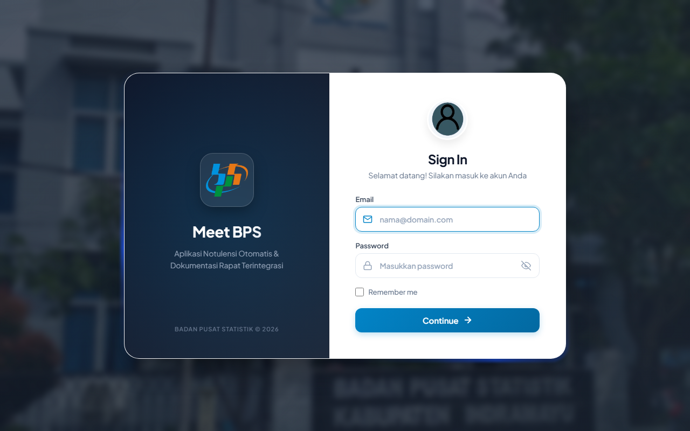

2. Masukkan **Email** yang terdaftar
3. Masukkan **Password** yang sesuai
4. *(Optional)* Centang **"Remember me"** agar sesi login tetap aktif di browser
5. Klik tombol **"Login"**

**Setelah Login:**

- Jika login sebagai **Admin/Super Admin**, Anda akan dialihkan ke halaman **Dashboard Admin** (`/admin`)
- Jika login sebagai **User**, Anda akan dialihkan ke halaman **Join Meeting** (`/join`)

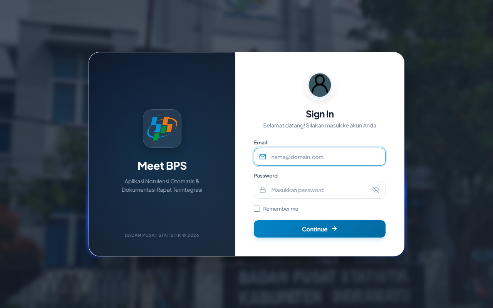

> **Catatan:** Jika email atau password salah, akan muncul pesan error "Email atau password salah."

## 2.2 Logout

1. Klik ikon **profil** di pojok kanan atas
2. Klik tombol **"Logout"** atau menu **"Logout"** dari dropdown
3. Anda akan dialihkan ke halaman login

---

---

# BAB 3 - Panduan User

## 3.1 Join Meeting

**Langkah-langkah Bergabung ke Meeting:**

1. Login sebagai User, Anda akan diarahkan ke halaman **Join Meeting**
2. Atau akses langsung ke `https://meet-bps.my.id/join`

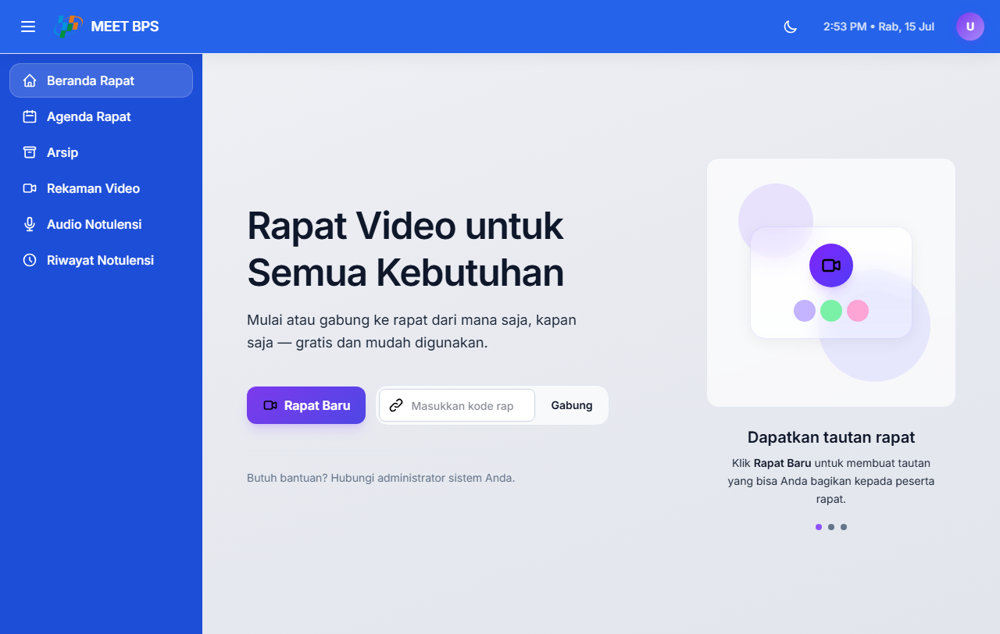

3. Masukkan **Kode Meeting** (ID meeting) di kolom yang tersedia
4. Klik tombol **"Join"** atau **"Masuk"**
5. Anda akan masuk ke **Ruang Meeting** (Room) jika meeting sedang aktif

**Buat Meeting Baru dari Halaman Join:**

1. Klik tombol **"Buat Rapat Baru"**
2. Isi form berikut:
   - **Nama Rapat** (wajib)
   - **Tanggal & Waktu** (untuk meeting terjadwal)
   - **Tipe Meeting**: Online atau Offline
   - **Hak Akses**: "Semua Orang" atau "Pilih User" (undangan)
   - **Deskripsi** (opsional)
3. Klik **"Buat Rapat"**

## 3.2 Buat Meeting Baru

Meeting dapat dibuat dari dua tempat:
- Halaman **Join Meeting** (`/join`)
- Halaman **Agenda** (`/agenda`)

### Opsi Pembuatan Meeting

| Opsi | Keterangan |
|------|------------|
| **Nama Rapat** | Judul/nama meeting (wajib diisi) |
| **Tipe Meeting** | `Online` (via LiveKit WebRTC) atau `Offline` (hanya informasi) |
| **Mode Waktu** | `Sekarang` (meeting langsung) atau `Terjadwal` (pilih tanggal/waktu) |
| **Hak Akses** | `Semua Orang` (siapa saja bisa join) atau `Pilih User` (hanya user terpilih) |
| **User Picker** | Muncul jika hak akses "Pilih User" - ketik nama untuk mencari user |
| **Deskripsi** | Keterangan tambahan (opsional, maks 5000 karakter) |

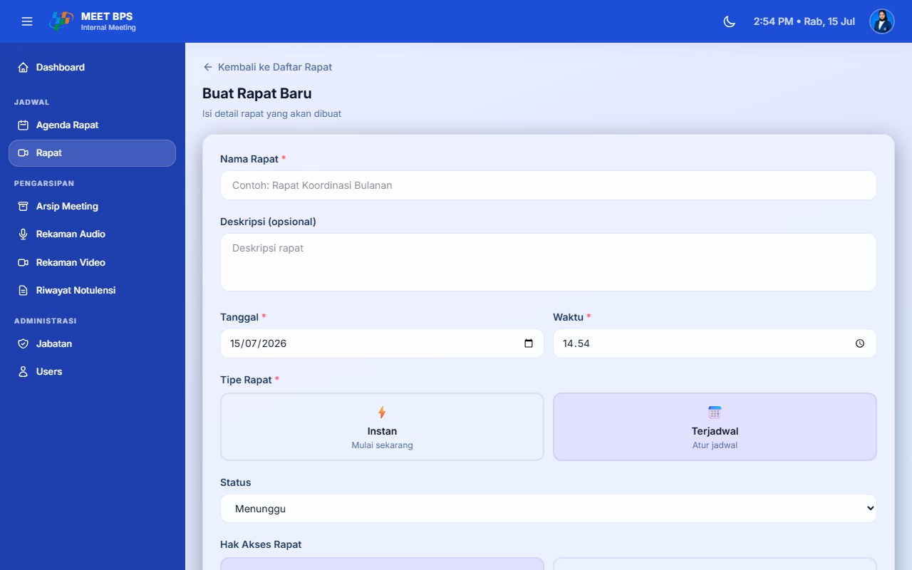

### Status Meeting

| Status | Keterangan |
|--------|------------|
| **Menunggu** | Meeting belum dimulai |
| **Berlangsung** | Meeting sedang berlangsung |
| **Selesai** | Meeting sudah selesai |

## 3.3 Ruang Meeting (Room)

Ruang meeting adalah tempat berlangsungnya video conference. Fitur yang tersedia:


### Kontrol Dasar

| Tombol | Fungsi |
|--------|--------|
| **Kamera** | Nyalakan/matikan kamera |
| **Mic** | Nyalakan/matikan mikrofon |
| **Screen Share** | Bagikan layar ke peserta lain |
| **Leave** | Keluar dari ruang meeting |
| **End** | Akhiri meeting (hanya pembuat meeting) |

### Fitur di Dalam Room

- **Video Grid**: Menampilkan video semua peserta dalam grid
- **Participant Sidebar**: Daftar peserta yang sedang aktif
- **Top Bar**: Informasi nama meeting dan kontrol tema
- **Toolbar**: Kontrol utama di bagian bawah layar

### Langkah Masuk ke Ruang Meeting

1. Setelah join meeting, halaman akan menampilkan **Ruang Meeting**
2. Sistem akan meminta izin akses **kamera** dan **mikrofon** browser
3. Centang **"Remember this choice"** agar tidak diminta lagi
4. Klik **"Allow"** atau **"Izinkan"**
5. Anda akan masuk ke ruang meeting
6. Kamera dan mic akan aktif secara default
7. Klik tombol kamera/mic untuk mengaktifkan/mematikan

### Screen Sharing

1. Klik tombol **Screen Share** di toolbar
2. Pilih layar atau aplikasi yang ingin dibagikan
3. Klik **"Share"**
4. Layar Anda akan terlihat oleh semua peserta
5. Klik **"Stop Sharing"** untuk berhenti

### Transkripsi Live

Jika meeting memiliki fitur transkripsi aktif:
- Sidebar transkripsi akan muncul di sisi kanan
- Teks transkripsi akan muncul secara real-time saat peserta berbicara
- Setiap pembicara ditandai dengan nama dan waktu

### AI Notulensi

1. Klik tombol **"AI Notulen"** di toolbar (hanya untuk pembuat meeting)
2. Proses akan dimulai: **Extract Audio → Transcribe → Summarize → Generate PDF**
3. Status proses akan ditampilkan secara real-time
4. Ketika selesai, hasil notulensi akan muncul
5. Klik **"Download PDF"** untuk mengunduh

### Keluar dari Meeting

- **Leave Meeting**: Anda keluar, tapi meeting tetap berjalan
- **End Meeting**: Meeting berakhir untuk semua peserta (hanya pembuat meeting yang bisa)

## 3.4 Agenda / Kalender

Akses: `https://meet-bps.my.id/agenda`

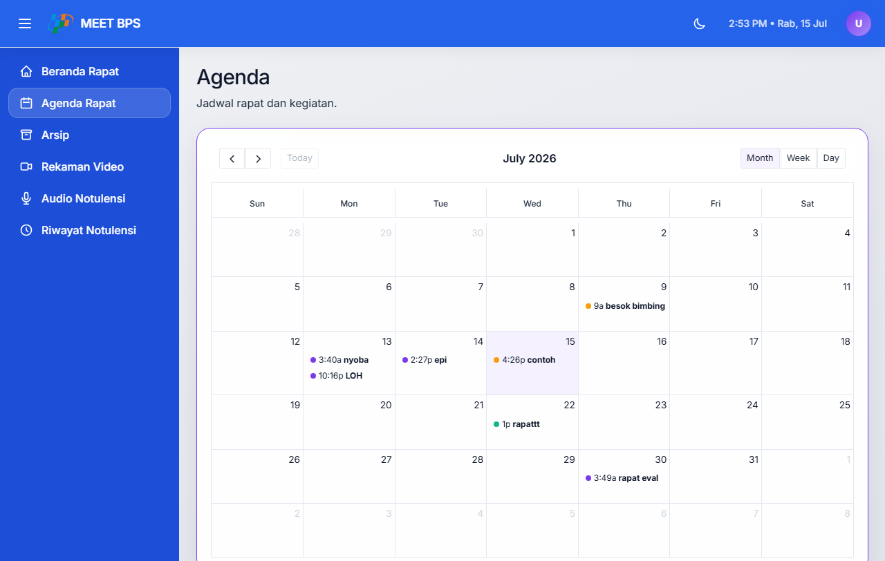

Halaman agenda menampilkan jadwal rapat dalam format kalender.

### Fitur Agenda

| Fitur | Keterangan |
|-------|------------|
| **Tampilan Bulan** | Lihat semua rapat dalam satu bulan |
| **Tampilan Minggu** | Detail rapat per minggu |
| **Tampilan Hari** | Detail rapat per hari |
| **Buat Meeting** | Tombol untuk membuat meeting baru dari kalender |
| **Klik Event** | Klik pada event untuk melihat detail rapat |

### Cara Melihat Detail Rapat

1. Buka halaman **Agenda**
2. Klik pada event/rapat di kalender
3. Detail rapat akan muncul (nama, tanggal, status, link)

### Cara Membuat Meeting dari Agenda

1. Klik tombol **"Buat Rapat Baru"**
2. Isi form pembuatan meeting
3. Klik **"Buat Rapat"**
4. Meeting akan muncul di kalender

## 3.5 Arsip / Riwayat

Akses: `https://meet-bps.my.id/riwayat`

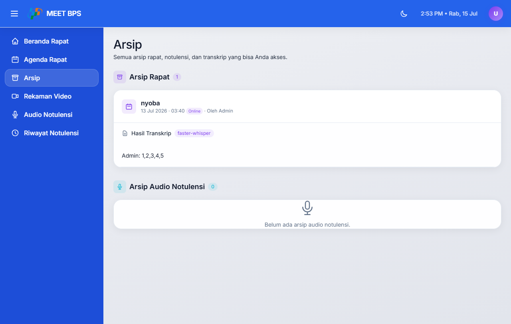

Halaman arsip menampilkan daftar rapat yang sudah selesai beserta hasilnya.

### Bagian Arsip Rapat

| Kolom | Keterangan |
|-------|------------|
| **Nama Rapat** | Judul meeting |
| **Tanggal** | Tanggal pelaksanaan |
| **Status** | Status meeting (Berlangsung/Selesai) |
| **Aksi** | Tombol aksi (Notulensi, Transkrip, Rekaman, Share) |

### Bagian Arsip Audio

| Kolom | Keterangan |
|-------|------------|
| **Judul** | Nama audio notulensi |
| **Tanggal** | Tanggal rekam |
| **Durasi** | Durasi rekaman |
| **Aksi** | Tombol aksi (Lihat, Edit, Download PDF) |

### Aksi yang Tersedia

| Tombol | Fungsi |
|--------|--------|
| **Notulensi** | Lihat hasil notulensi rapat |
| **Transkrip** | Lihat transkripsi lengkap rapat |
| **Rekaman** | Putar rekaman audio/video rapat |
| **Share** | Ubah akses notulensi (Peserta/Semua User/Pilih User) |
| **PDF** | Download notulensi dalam format PDF |
| **Edit** | Edit hasil notulensi (ringkasan, topik, dll) |

### Cara Share Notulensi

1. Di halaman Arsip, klik tombol **"Share"** pada kartu rapat
2. Pilih mode akses:
   - **Peserta Rapat**: Hanya peserta yang bisa melihat
   - **Semua User**: Semua user di sistem bisa melihat
   - **Pilih User**: Pilih user tertentu
3. Jika memilih "Pilih User", cari dan pilih user yang diinginkan
4. Klik **"Simpan"**

## 3.6 Audio Notulensi

### Halaman Utama Audio

Akses: `https://meet-bps.my.id/audio`

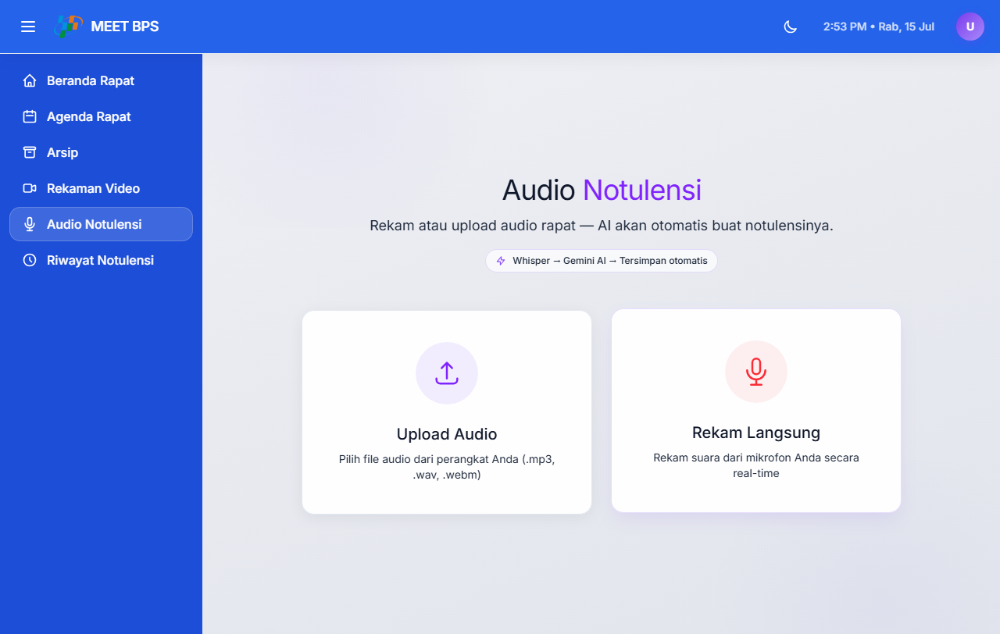

Halaman audio notulensi memungkinkan Anda merekam atau mengupload audio untuk dijadikan notulensi.

### Fitur Utama

| Fitur | Keterangan |
|-------|------------|
| **Rekam Audio** | Rekam langsung dari mikrofon browser |
| **Upload Audio** | Upload file audio yang sudah ada |
| **Waveform** | Visualisasi gelombang audio secara real-time |
| **Step Progress** | Indikator progress: Record → Transcribe → Summarize → Done |

### Cara Rekam Audio Baru

1. Buka halaman **Audio Notulensi**
2. Klik tombol **"Mulai Rekam"**
3. Berbicara ke mikrofon
4. Waveform akan bergerak mengikuti suara
5. Klik **"Stop Rekam"** saat selesai
6. Sistem akan otomatis:
   - Menyimpan file audio
   - Menjalankan transkripsi (Whisper AI)
   - Menjalankan summarization (DeepSeek/Gemini)
   - Menampilkan hasil notulensi

### Cara Upload File Audio

1. Klik tab **"Upload"**
2. Pilih file audio dari komputer (format: MP3, WAV, M4A)
3. Klik **"Upload"**
4. Proses transkripsi dan summarization akan berjalan otomatis

### Halaman History Audio

Akses: `https://meet-bps.my.id/audio/history`

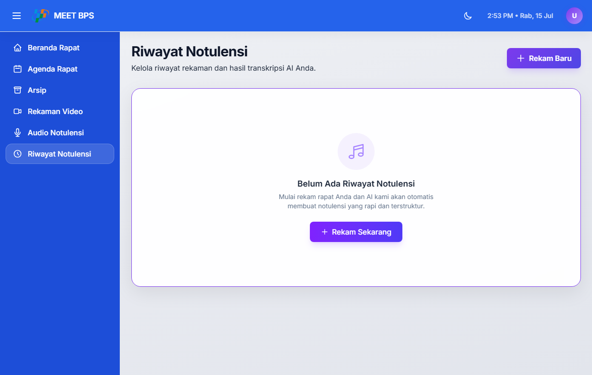

Menampilkan daftar semua audio notulensi yang pernah dibuat.

| Kolom | Keterangan |
|-------|------------|
| **Judul** | Nama audio notulensi |
| **Tanggal** | Tanggal rekam |
| **Durasi** | Durasi rekaman |
| **Status** | Status pemrosesan |
| **Aksi** | Lihat, Edit, Download PDF, Hapus |

### Detail Audio Notulensi

Akses: `https://meet-bps.my.id/audio/{id}`


Menampilkan detail lengkap audio notulensi:
- Informasi audio (tanggal, durasi)
- Hasil transkripsi (full text)
- Ringkasan notulensi
- Tombol **Edit**, **Download PDF**, **Hapus**

### Edit Audio Notulensi

Akses: `https://meet-bps.my.id/audio/{id}/edit`

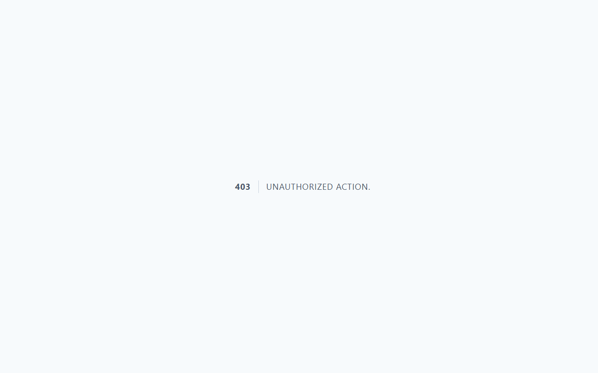

Anda dapat mengedit:
- **Judul** rapat
- **Ringkasan** notulensi
- **Topik Dibahas**
- **Keputusan Penting**
- **Action Items** (Tugas, PIC, Deadline)
- **Risiko / Catatan**

Klik **"Simpan Perubahan"** setelah selesai mengedit.

## 3.7 Video Rekaman

Akses: `https://meet-bps.my.id/videos`

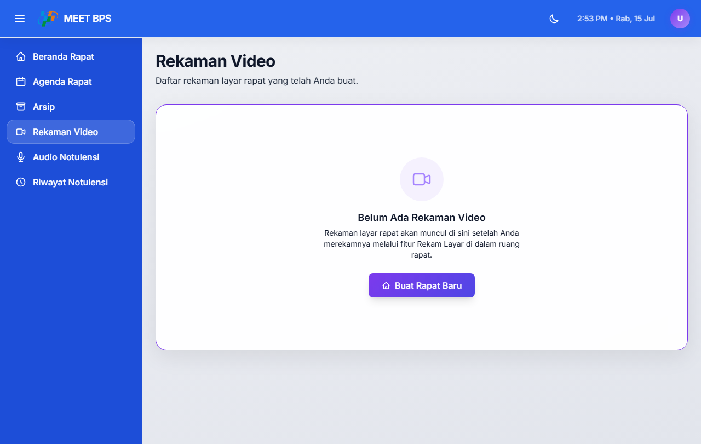

Halaman video menampilkan daftar rekaman layar (screen recording) dari rapat yang diikuti.

### Fitur Video

| Fitur | Keterangan |
|-------|------------|
| **Daftar Video** | Semua rekaman video yang bisa diakses |
| **Streaming** | Putar video langsung di browser |
| **Download** | Unduh file video |
| **Hapus** | Hapus rekaman video (hanya creator) |

### Cara Menonton Video

1. Buka halaman **Video**
2. Klik **"Putar"** atau **"Tonton"** pada video yang dipilih
3. Video akan diputar di halaman baru
4. Gunakan kontrol player untuk memutar, pause, dan mengatur volume

### Otorisasi Akses

- Hanya **creator meeting**, **peserta meeting**, atau **admin** yang bisa mengakses video

## 3.8 Profil Pengguna

Akses: `https://meet-bps.my.id/profile`

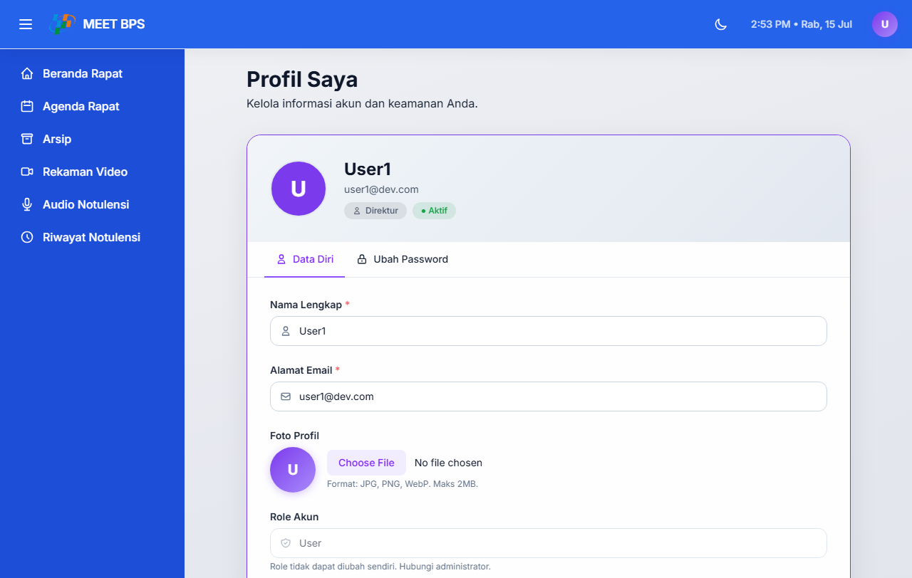

### Fitur Profil

| Fitur | Keterangan |
|-------|------------|
| **Lihat Profil** | Informasi akun (nama, email, foto, role) |
| **Edit Profil** | Ubah nama dan email |
| **Foto Profil** | Upload atau hapus foto avatar |
| **Ganti Password** | Ubah password dengan konfirmasi password lama |
| **Hapus Akun** | Hapus akun secara permanen |

### Cara Edit Profil

1. Buka halaman **Profile**
2. Klik tombol **"Edit"** atau **"Ubah Profil"**
3. Ubah **Nama** atau **Email**
4. Klik **"Simpan"**

### Cara Upload Foto Profil

1. Buka halaman **Profile**
2. Klik area foto profil atau tombol **"Upload Foto"**
3. Pilih file gambar (JPG, PNG, WebP, maks 2MB)
4. Foto akan otomatis terupload

### Cara Ganti Password

1. Buka halaman **Profile**
2. Scroll ke bagian **"Ganti Password"**
3. Masukkan **Password Lama**
4. Masukkan **Password Baru** (min 8 karakter, huruf besar + kecil + angka)
5. Masukkan **Konfirmasi Password Baru**
6. Klik **"Simpan"**

### Cara Hapus Akun

> **Peringatan:** Tindakan ini tidak dapat dibatalkan!

1. Buka halaman **Profile**
2. Scroll ke bagian paling bawah
3. Klik tombol **"Hapus Akun"**
4. Masukkan password untuk konfirmasi
5. Klik **"Ya, Hapus Akun"**

---

---

# BAB 4 - Panduan Admin

## 4.1 Dashboard Admin

Akses: `https://meet-bps.my.id/admin`

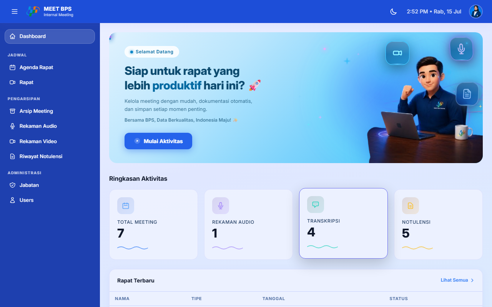

Dashboard admin menampilkan ringkasan statistik sistem.

### Statistik yang Ditampilkan

| Statistik | Keterangan |
|-----------|------------|
| **Total Users** | Jumlah user terdaftar |
| **Total Meetings** | Jumlah rapat (online + offline) |
| **Online Meetings** | Jumlah rapat online |
| **Offline Meetings** | Jumlah rapat offline |
| **Total Recordings** | Jumlah rekaman audio |
| **Total Transcriptions** | Jumlah transkrip |
| **Total Notulensi** | Jumlah notulensi yang dihasilkan |
| **Recent Meetings** | 5 rapat terakhir |

## 4.2 Manajemen User

Akses: `https://meet-bps.my.id/admin/users`

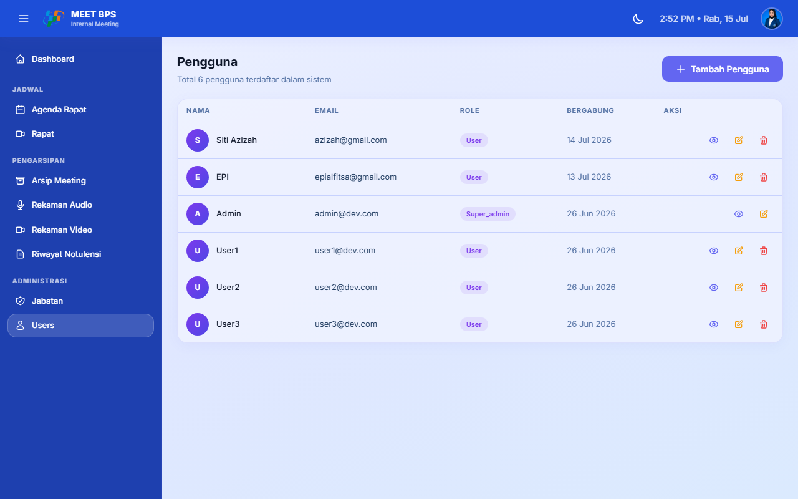

### Daftar User

| Kolom | Keterangan |
|-------|------------|
| **No** | Nomor urut |
| **Nama** | Nama lengkap user |
| **Email** | Alamat email |
| **Role** | Role user (super_admin/admin/user) |
| **Aksi** | Tombol Edit, Hapus |

### Cara Membuat User Baru

1. Buka halaman **Admin → Users**
2. Klik tombol **"Tambah User"** atau **"Create"**
3. Isi form:
   - **Nama** (wajib)
   - **Email** (wajib, unik)
   - **Password** (min 8 karakter)
   - **Konfirmasi Password**
   - **Role** (super_admin/admin/user)
4. Klik **"Simpan"** atau **"Create"**

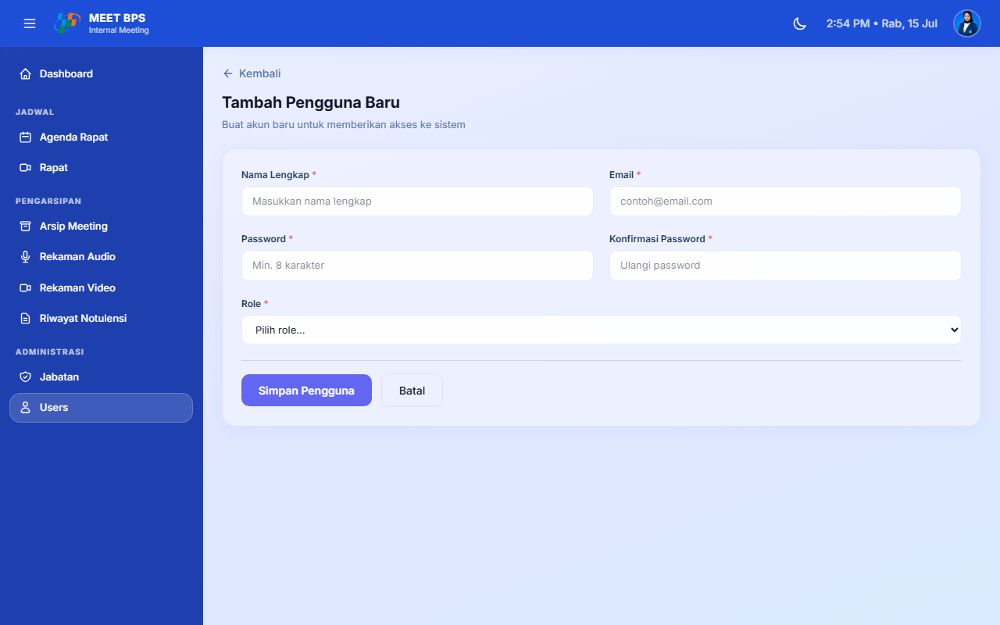

> **Catatan:** Hanya super_admin yang bisa menetapkan role `super_admin` ke user lain.

### Cara Edit User

1. Buka halaman **Admin → Users**
2. Klik tombol **"Edit"** pada user yang dipilih
3. Ubah data yang diperlukan
4. Klik **"Update"**

### Cara Hapus User

1. Buka halaman **Admin → Users**
2. Klik tombol **"Hapus"** pada user yang dipilih
3. Konfirmasi penghapusan
4. User akan dihapus beserta data terkait

> **Catatan:** User dengan role `super_admin` tidak bisa dihapus.

## 4.3 Manajemen Role & Permission

Akses: `https://meet-bps.my.id/admin/roles`

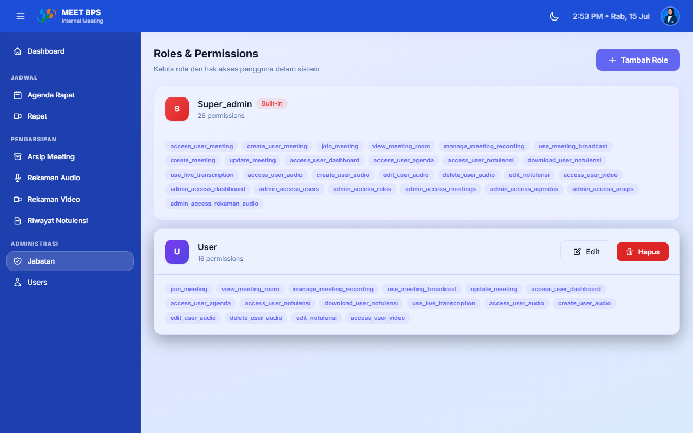

### Daftar Role

| Kolom | Keterangan |
|-------|------------|
| **Nama Role** | Nama role |
| **Guard** | Guard name (web) |
| **Permission** | Jumlah permission yang dimiliki |
| **Aksi** | Tombol Edit, Hapus |

### Cara Membuat Role Baru

1. Buka halaman **Admin → Roles**
2. Klik tombol **"Tambah Role"** atau **"Create"**
3. Isi **Nama Role**
4. Centang **Permission** yang diinginkan
5. Klik **"Simpan"**


### Permission yang Tersedia

Permission dikelompokkan berdasarkan prefix:

| Prefix | Keterangan |
|--------|------------|
| `admin_access_*` | Akses panel admin |
| `join_meeting` | Bergabung ke meeting |
| `view_meeting_room` | Melihat ruang meeting |
| `create_meeting` | Membuat meeting baru |
| `manage_meeting_recording` | Mengelola rekaman meeting |
| `use_meeting_broadcast` | Menggunakan fitur broadcast |
| `use_live_transcription` | Menggunakan transkripsi live |
| `access_user_audio` | Mengakses fitur audio |
| `create_user_audio` | Membuat audio baru |
| `access_user_notulensi` | Melihat notulensi |
| `download_user_notulensi` | Download notulensi PDF |

> **Catatan:** Role `super_admin` tidak bisa diedit atau dihapus.

## 4.4 Manajemen Meeting

Akses: `https://meet-bps.my.id/admin/meetings`

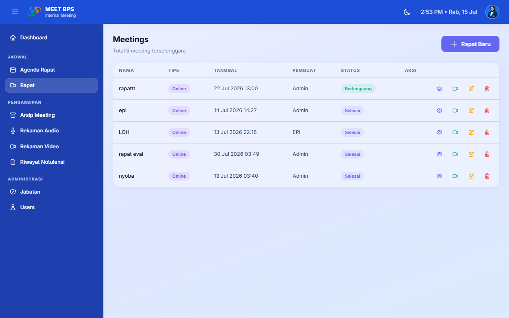

### Daftar Meeting

| Kolom | Keterangan |
|-------|------------|
| **Nama Meeting** | Judul rapat |
| **Tanggal** | Tanggal pelaksanaan |
| **Status** | Status meeting |
| **Pembuat** | Nama pembuat meeting |
| **Aksi** | Tombol Lihat, Edit, Hapus |

### Cara Membuat Meeting

1. Buka halaman **Admin → Meetings**
2. Klik tombol **"Create Meeting"** atau **"Tambah"**
3. Isi form meeting (lihat BAB 3.2 untuk detail)
4. Klik **"Simpan"**


### Detail Meeting

Halaman detail meeting menampilkan:
- Informasi meeting (nama, tanggal, status, tipe)
- Daftar peserta yang sudah join
- Daftar akses user (jika undangan)
- Rekaman audio terkait
- Agenda terkait
- Transkrip terkait
- Notulensi terkait

### Cara Edit Meeting

1. Buka halaman **Admin → Meetings**
2. Klik tombol **"Edit"** pada meeting yang dipilih
3. Ubah data meeting
4. Klik **"Update"**

### Cara Hapus Meeting

1. Buka halaman **Admin → Meetings**
2. Klik tombol **"Hapus"** pada meeting yang dipilih
3. Konfirmasi penghapusan
4. Meeting beserta data terkait akan dihapus

## 4.5 Manajemen Agenda

Akses: `https://meet-bps.my.id/admin/agendas`

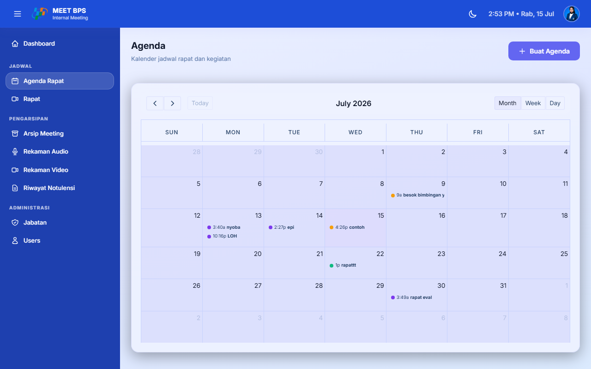

### Daftar Agenda

Menampilkan semua rapat sebagai agenda dengan format tabel.

| Kolom | Keterangan |
|-------|------------|
| **Tanggal** | Tanggal rapat |
| **Waktu** | Waktu rapat |
| **Nama Rapat** | Judul rapat |
| **Tipe** | Tipe agenda |
| **Keterangan** | Deskripsi rapat |
| **Aksi** | Tombol Edit, Hapus |

### Cara Edit Agenda

1. Buka halaman **Admin → Agendas**
2. Klik tombol **"Edit"** pada agenda yang dipilih
3. Ubah data agenda
4. Klik **"Update"**

### Cara Hapus Agenda

1. Buka halaman **Admin → Agendas**
2. Klik tombol **"Hapus"** pada agenda yang dipilih
3. Konfirmasi penghapusan

## 4.6 Manajemen Notulensi

Akses: `https://meet-bps.my.id/admin/notulensis`

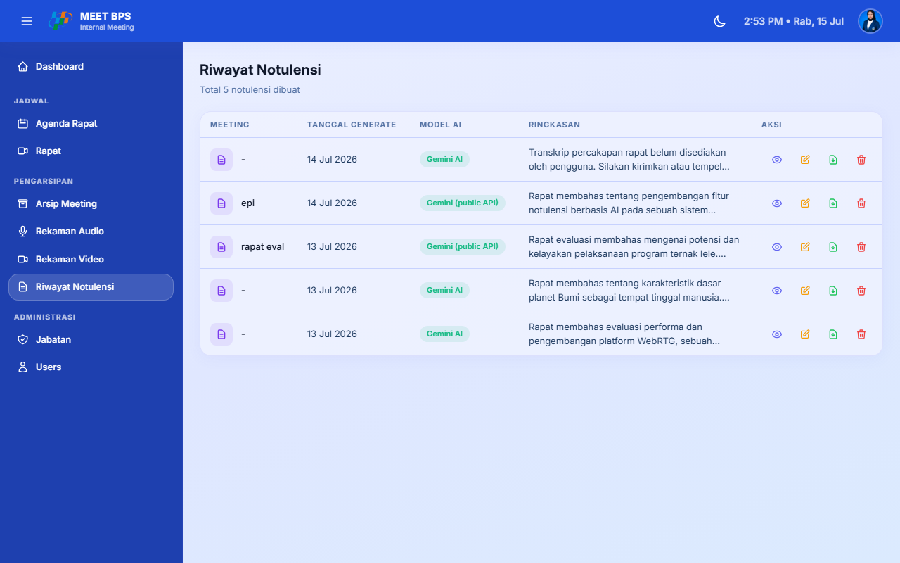

### Daftar Notulensi

| Kolom | Keterangan |
|-------|------------|
| **Nama Rapat** | Judul meeting terkait |
| **Tanggal** | Tanggal generate notulensi |
| **Model AI** | Model AI yang digunakan |
| **Aksi** | Tombol Lihat, Edit, Download PDF, Hapus |

### Detail Notulensi

Akses: `https://meet-bps.my.id/admin/notulensis/{id}`


Halaman detail menampilkan:
- **Ringkasan**: Deskripsi singkat rapat
- **Topik Dibahas**: Daftar topik yang dibahas
- **Keputusan Penting**: Keputusan yang diambil
- **Action Items**: Tugas yang harus diselesaikan (Tugas, PIC, Deadline)
- **Risiko / Catatan**: Risiko dan catatan penting
- **Info Akses**: Mode akses notulensi (Peserta/Semua User/Pilih User)
- **Tombol Share**: Untuk mengubah akses notulensi

### Edit Notulensi

Akses: `https://meet-bps.my.id/admin/notulensis/{id}/edit`


Anda dapat mengedit:
- **Nama Rapat**
- **Ringkasan**
- **Topik Dibahas** (tambah/hapus baris)
- **Keputusan Penting** (tambah/hapus baris)
- **Action Items** (tambah/hapus baris, edit Tugas/PIC/Deadline)
- **Risiko / Catatan** (tambah/hapus baris)

Klik **"Simpan Perubahan"** setelah selesai.

### Download PDF

1. Buka halaman detail notulensi
2. Klik tombol **"Unduh PDF"**
3. File PDF akan terunduh

### Ubah Akses Notulensi

1. Buka halaman detail atau edit notulensi
2. Klik tombol **"Share"** atau **"Ubah Akses"**
3. Pilih mode akses:
   - **Peserta Rapat**: Hanya peserta rapat yang bisa melihat
   - **Semua User**: Semua user di sistem
   - **Pilih User**: User tertentu saja
4. Jika "Pilih User", cari dan pilih user
5. Klik **"Simpan"**

## 4.7 Rekaman Audio

Akses: `https://meet-bps.my.id/admin/rekaman-audio`

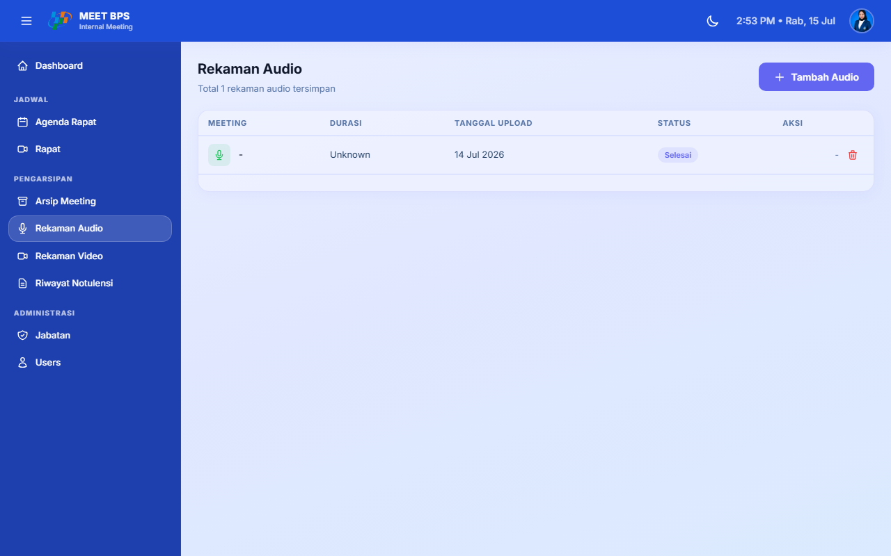

### Daftar Rekaman Audio

Menampilkan semua rekaman audio dari rapat.

| Kolom | Keterangan |
|-------|------------|
| **Nama Rapat** | Judul meeting terkait |
| **File** | Nama file audio |
| **Durasi** | Durasi rekaman |
| **Ukuran** | Ukuran file |
| **Aksi** | Tombol Play, Hapus |

### Cara Memutar Audio

1. Buka halaman **Admin → Rekaman Audio**
2. Klik tombol **"Play"** atau **"Putar"** pada rekaman
3. Audio akan diputar di browser

### Cara Hapus Audio

1. Buka halaman **Admin → Rekaman Audio**
2. Klik tombol **"Hapus"** pada rekaman
3. Konfirmasi penghapusan
4. File audio juga akan dihapus dari server

## 4.8 Rekaman Video

Akses: `https://meet-bps.my.id/admin/rekaman-video`

### Daftar Rekaman Video

Menampilkan semua rekaman video (screen recording) dari rapat.

| Kolom | Keterangan |
|-------|------------|
| **Nama Rapat** | Judul meeting terkait |
| **File** | Nama file video |
| **Durasi** | Durasi rekaman |
| **Ukuran** | Ukuran file |
| **Aksi** | Tombol Stream, Download, Hapus |

### Fitur Video Admin

- **Streaming**: Putar video langsung di browser
- **Download**: Unduh file video
- **Hapus**: Hapus rekaman video

## 4.9 Manajemen Transkrip

Akses: `https://meet-bps.my.id/admin/transkrips`

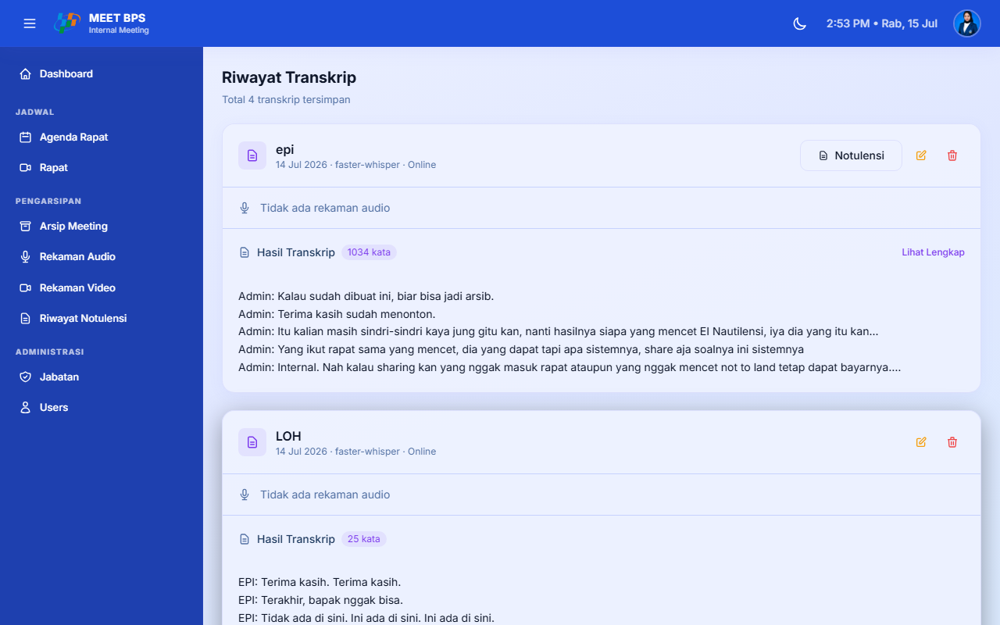

### Daftar Transkrip

| Kolom | Keterangan |
|-------|------------|
| **Nama Rapat** | Judul meeting terkait |
| **Model AI** | Model AI yang digunakan |
| **Tanggal** | Tanggal transkrip dibuat |
| **Aksi** | Tombol Lihat, Edit, Hapus |

### Detail Transkrip

Akses: `https://meet-bps.my.id/admin/transkrips/{id}`


Menampilkan teks transkripsi lengkap dari rapat.

### Cara Membuat Transkrip

1. Buka halaman **Admin → Transkrips**
2. Klik tombol **"Create"** atau **"Tambah"**
3. Pilih **Meeting** dari dropdown
4. Isi **Teks Transkrip**
5. Pilih **Model AI** (opsional)
6. Klik **"Simpan"**

### Cara Edit Transkrip

1. Buka halaman **Admin → Transkrips**
2. Klik tombol **"Edit"** pada transkrip
3. Ubah teks transkrip
4. Klik **"Update"**

## 4.10 Riwayat Meeting

Akses: `https://meet-bps.my.id/admin/riwayat-meeting`

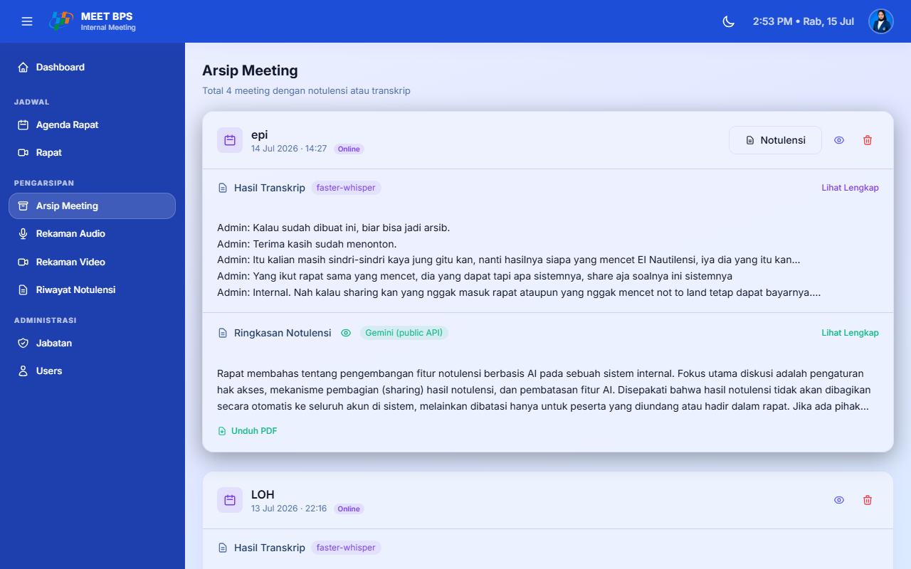

Menampilkan daftar rapat yang sudah selesai beserta transkrip dan notulensinya.

| Kolom | Keterangan |
|-------|------------|
| **Nama Rapat** | Judul meeting |
| **Tanggal** | Tanggal rapat |
| **Status** | Status meeting |
| **Aksi** | Tombol Lihat Detail, Hapus |

### Cascade Delete

Saat menghapus riwayat rapat, data terkait juga akan dihapus:
- Transkrip rapat
- Notulensi rapat
- Arsip rapat

## 4.11 Profil Admin

Akses: `https://meet-bps.my.id/admin/profile`

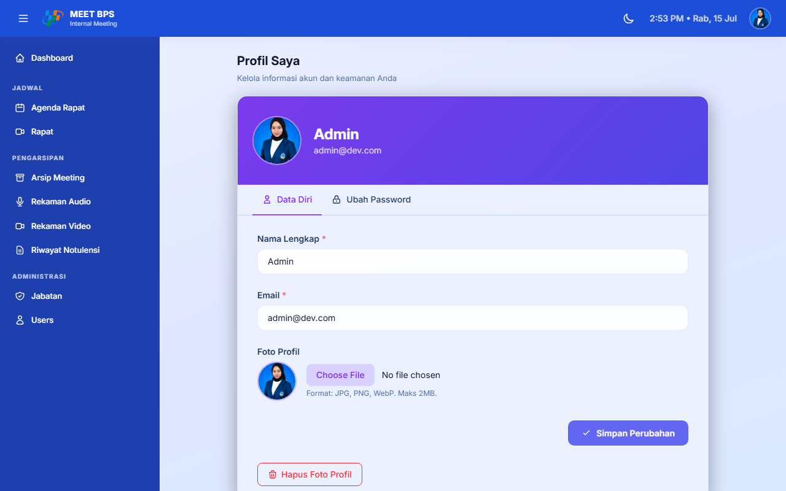

Fitur profil admin mirip dengan profil user (lihat BAB 3.8):
- Edit nama dan email
- Upload/hapus foto profil
- Ganti password
- Hapus akun admin

---

---

# BAB 5 - Alur Kerja AI Notulensi

## 5.1 Transkripsi Live di Ruang Meeting

### Alur Kerja

```
Peserta Berbicara
      ↓
Audio Capture (Web Audio API)
      ↓
Voice Activity Detection (VAD)
      ↓
PCM Audio Chunks
      ↓
Whisper WebSocket Server
      ↓
Teks Transkrip
      ↓
Broadcast ke Semua Peserta
      ↓
Simpan ke Database (Transkrip)
```

### Penjelasan

1. **Audio Capture**: Browser menangkap audio dari mikrofon setiap peserta
2. **VAD**: Mendeteksi kapan peserta sedang berbicara (bukan diam)
3. **PCM Chunks**: Audio dikirim dalam potongan-potongan kectic
4. **Whisper**: Server Whisper (lokal) mengubah audio menjadi teks
5. **Broadcast**: Teks transkrip dikirim ke semua peserta via WebSocket
6. **Simpan**: Teks disimpan ke database sebagai transkrip rapat

## 5.2 Generate Notulensi Otomatis

### Alur Kerja

```
Klik "AI Notulen"
      ↓
Cek Transkrip yang Ada
      ↓
Set Pipeline Status: Processing
      ↓
Kirim ke DeepSeek API
      ↓ (jika gagal)
Fallback ke Gemini API
      ↓
Terima JSON Response
      ↓
Simpan ke Database (Notulensi)
      ↓
Generate PDF via DomPDF
      ↓
Buat Arsip
      ↓
Set Pipeline Status: Completed
      ↓
Tampilkan Hasil
```

### Penjelasan

1. **Mulai**: Pengguna klik tombol "AI Notulen" di ruang meeting
2. **Cek Transkrip**: Sistem memeriksa apakah sudah ada transkrip rapat
3. **Pipeline**: Status pipeline diatur ke "processing"
4. **DeepSeek**: Transkrip dikirim ke DeepSeek API untuk summarization
5. **Fallback**: Jika DeepSeek gagal (misal: insufficient balance), sistem menggunakan Gemini API (gratis)
6. **JSON Response**: AI mengembalikan notulensi dalam format JSON terstruktur
7. **Simpan**: Notulensi disimpan ke database
8. **PDF**: PDF notulensi dihasilkan menggunakan DomPDF
9. **Arsip**: Arsip otomatis dibuat untuk pengarsipan
10. **Selesai**: Status pipeline diatur ke "completed"

## 5.3 Struktur Hasil Notulensi

Notulensi yang dihasilkan memiliki struktur berikut:

```json
{
  "ringkasan": "Deskripsi singkat rapat...",
  "topik_dibahas": [
    "Topik 1 yang dibahas dalam rapat",
    "Topik 2 yang dibahas dalam rapat"
  ],
  "keputusan": [
    "Keputusan 1 yang diambil",
    "Keputusan 2 yang diambil"
  ],
  "action_items": [
    {
      "task": "Tugas yang harus diselesaikan",
      "pic": "PIC yang bertanggung jawab",
      "deadline": "Deadline penyelesaian"
    }
  ],
  "risiko_catatan": [
    "Risiko atau catatan penting 1",
    "Risiko atau catatan penting 2"
  ]
}
```

### Penjelasan Field

| Field | Keterangan |
|-------|------------|
| `ringkasan` | Ringkasan singkat isi rapat (1-2 paragraf) |
| `topik_dibahas` | Daftar topik yang dibahas dalam rapat |
| `keputusan` | Keputusan-keputusan yang diambil |
| `action_items` | Tugas-tugas yang harus diselesaikan beserta PIC dan deadline |
| `risiko_catatan` | Risiko dan catatan penting dari rapat |

## 5.4 Sharing / Akses Notulensi

Setelah notulensi dihasilkan, pengguna dapat mengatur siapa yang bisa mengaksesnya.

### Mode Akses

| Mode | Keterangan |
|------|------------|
| **Peserta Rapat** | Hanya user yang bergabung di rapat ini yang bisa melihat notulensi |
| **Semua User** | Semua user yang terdaftar di sistem bisa melihat notulensi |
| **Pilih User** | Hanya user tertentu yang dipilih secara manual yang bisa melihat notulensi |

### Cara Mengubah Akses Notulensi

**Dari Halaman Arsip (User):**

1. Buka halaman **Arsip** (`/riwayat`)
2. Klik tombol **"Share"** pada kartu rapat
3. Pilih mode akses
4. Jika "Pilih User", cari dan pilih user
5. Klik **"Simpan"**

**Dari Halaman Notulensi (User):**

1. Buka halaman notulensi rapat (`/meeting/{id}/notulensi`)
2. Klik tombol **"Share"**
3. Pilih mode akses
4. Klik **"Simpan"**

**Dari Admin (Admin):**

1. Buka halaman **Admin → Notulensi**
2. Klik tombol **"Lihat"** pada notulensi
3. Klik tombol **"Share"** atau **"Ubah Akses"**
4. Pilih mode akses
5. Klik **"Simpan"**

### Info Akses di Tampilan

Di halaman detail notulensi, informasi akses ditampilkan:

| Tampilan | Keterangan |
|----------|------------|
| **Peserta Rapat (X orang)** | Menampilkan daftar peserta yang diizinkan |
| **Semua User** | Semua user bisa mengakses |
| **Pilih User (X user)** | Menampilkan daftar user yang dipilih |

---

---

# Lampiran

## A. Daftar Permission

Berikut adalah daftar lengkap permission dalam sistem:

### Permission Admin

| No | Permission | Keterangan |
|----|-----------|------------|
| 1 | `admin_access_dashboard` | Mengakses dashboard admin |
| 2 | `admin_access_users` | Mengelola user |
| 3 | `admin_access_roles` | Mengelola role & permission |
| 4 | `admin_access_meetings` | Mengelola meeting |
| 5 | `admin_access_agendas` | Mengelola agenda |
| 6 | `admin_access_arsips` | Mengelola arsip |
| 7 | `admin_access_rekaman_audio` | Mengelola rekaman audio |

### Permission User

| No | Permission | Keterangan |
|----|-----------|------------|
| 1 | `join_meeting` | Bergabung ke meeting |
| 2 | `view_meeting_room` | Melihat ruang meeting |
| 3 | `create_meeting` | Membuat meeting baru |
| 4 | `update_meeting` | Mengubah meeting |
| 5 | `manage_meeting_recording` | Mengelola rekaman meeting |
| 6 | `use_meeting_broadcast` | Menggunakan fitur broadcast |
| 7 | `access_user_agenda` | Mengakses agenda |
| 8 | `use_live_transcription` | Menggunakan transkripsi live |
| 9 | `access_user_notulensi` | Melihat notulensi |
| 10 | `download_user_notulensi` | Download notulensi PDF |
| 11 | `access_user_audio` | Mengakses fitur audio |
| 12 | `create_user_audio` | Membuat audio baru |
| 13 | `edit_user_audio` | Mengedit audio |
| 14 | `delete_user_audio` | Menghapus audio |
| 15 | `edit_notulensi` | Mengedit notulensi |
| 16 | `access_user_video` | Mengakses video rekaman |

## B. Glosarium

| Istilah | Penjelasan |
|---------|-----------|
| **WebRTC** | Web Real-Time Communication, teknologi untuk komunikasi real-time di browser |
| **LiveKit** | Platform open-source untuk video/audio conferencing via WebRTC |
| **Whisper** | Model AI dari OpenAI untuk transkripsi (speech-to-text) |
| **DeepSeek** | Model AI untuk summarization (text summarization) |
| **Gemini** | Model AI dari Google untuk summarization (fallback DeepSeek) |
| **Notulensi** | Ringkasan atau catatan hasil rapat (meeting minutes) |
| **Transkrip** | Teks lengkap percakapan dalam rapat |
| **Arsip** | Pengarsipan dokumen rapat (notulensi, transkrip, rekaman) |
| **Agenda** | Jadwal atau rencana rapat |
| **Pipeline** | Alur kerja otomatis (extract → transcribe → summarize → PDF) |
| **Role** | Peran pengguna dalam sistem (admin, user, super_admin) |
| **Permission** | Hak akses pengguna terhadap fitur tertentu |
| **VAD** | Voice Activity Detection, deteksi aktivitas suara |
| **PCM** | Pulse-Code Modulation, format audio digital |
| **DomPDF** | Library PHP untuk generate file PDF |
| **Alpine.js** | Framework JavaScript ringan untuk interaktivitas UI |
| **Blender** | Template engine PHP untuk Laravel (Blade) |
| **Migration** | Skema perubahan database di Laravel |
| **Seeder** | Script untuk mengisi data awal database |
| **Eloquent** | ORM (Object-Relational Mapping) di Laravel |

---

---

## Informasi Teknis

| Komponen | Teknologi |
|----------|-----------|
| Backend | Laravel 12, PHP 8.4 |
| Database | MySQL 8.0 |
| Frontend | Alpine.js, Tailwind CSS v4 |
| Video/Audio | LiveKit WebRTC |
| Transkripsi | Whisper (Python server) |
| AI Summarization | DeepSeek API + Gemini API |
| PDF Generation | DomPDF |
| Server | Nginx + PHP-FPM + Supervisor |
| Real-time | Laravel Echo (Pusher) + WebRTC Signaling |

---

**Dokumen ini dibuat pada: Juli 2026**
**Versi Aplikasi: 1.0**
